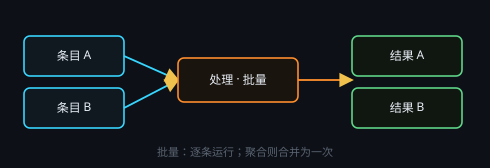

# 批量、拆分与合并

## 开启批量

输入节点右上角「批量」：文本用 ＋ / 导入 / 粘贴 YAML（`标题: 内容`）；图像可多选或一次拖入多张。

## 处理方式

处理节点头部 **批量 / 聚合**：

- **批量**：每条单独跑，输出多条。
- **聚合**：所有条目一次送入，输出一条。

## 拆分 / 合并

- **拆分**：从批次里抽出单项，生成只读节点。
- **合并**：多个输入汇成一个批次，下游按批量处理。

保存节点在批量链上按 `{文件名}_{输入节点标题}` 命名。详见 [输入 / 处理 / 保存](#io-proc)。
