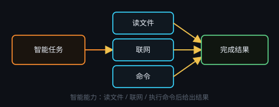

# 智能能力是什么

接入 DeepSeek Harness（dsh）后，模型不只生成文字，还能**读/写工作目录文件、联网搜索、执行命令、派子代理**。运行时随应用自带，**不用另装 Node**。

需要先配置带 API Key 的**文本服务商**。智能任务、智能会话、对话节点的「智能助手」、文本处理的「🐋 智能」都走这条引擎。

## 过程可见

运行中显示「◉ 思考中」，可展开思考与 **🔧 工具调用**。智能模式按任务完成计费，一次任务可能多次调用模型。

写文件前请确认 [工作目录](#workspace) 正确。权限过宽或过严见 [审批与权限](#approvals)。

## 思考与输出分开显示

一次运行按**发生顺序**分段显示，三类段各有各的样子：

- **◉ 思考 · N 字**：模型内部推理（reasoning），默认折叠，点开才看；N **只统计思考的字数**，不含工具与正文。
- **正文**：模型真说出来的话，正常字号、Markdown 渲染，一段一块——中间步骤说的话也以正文出现，不会被埋进思考里。
- **🔧 工具**：调用轨迹就近插在它发生的位置，点开看参数与结果；出错以 **⚠** 附在正文里。

每调用一次工具、或进入新的一步推理（turn / step），都自动另起一段。智能任务节点、智能会话、右侧全局助手、对话节点用的是**同一套分段**；节点上的「思考中」大窗上半是思考、下半是输出（工具调用轨迹）。

**下游数据不受影响**：输出端子给下游、以及存进保存节点的，仍是完整正文。旧的会话存档按原样显示。

## 交流语言（Agent 口味）

顶栏 **中 / EN** 选定界面语言后，这份语言会作为「口味」随每次智能运行一起下发：**用该语言交流，并期望 agent 用该语言回答**——提问、计划、进度说明、最终回答都跟随界面语言，派生的子任务与功能块绑定会话同样沿用。设置 · 智能能力 区块会显示当前用的是哪种语言。

口味只约束**交流**。代码、路径、命令与 API 字段名保持原文；事实库记录、表格单元格与写回文件的正文沿用资料原本的语言，不会因为切换界面语言而被翻译。用户在一轮对话里明确指定别的语言时，以用户为准。
