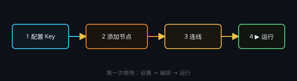

# 第一次使用

1. **配置服务商**  
   打开「设置 · API/配置」，从目录选择文本服务商（如 DeepSeek 官方），填写 **API Key**。Key 只保存在本机。图像能力另加图像服务商。
2. **添加节点**  
   在画布**空白处右键**，选「文本节点」或「文本处理节点」。标题可点击改名。
3. **连线**  
   从上游输出端子（右侧圆点）拖到下游输入端子（左侧圆点）。提示词里输入 `@` 可引用已连接节点。
4. **运行**  
   点处理节点上的 **▶**。若上游还没跑过，会自动先执行上游。

> 智能办事（读文件 / 联网 / 命令）见 [智能能力是什么](#dsh)。桌宠等可选组件见右上角「插件」。
