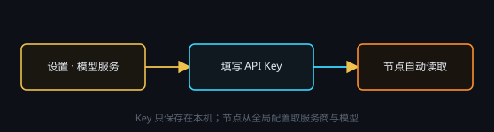

# 服务商与 API

打开 **设置 · API/配置 → 模型服务**：

1. **从目录添加**（推荐）：选服务商 → 填 Key → 自动载入模型列表与接口地址。含 DeepSeek 官方与 pi-ai 等目录。
2. **手动配置**：OpenAI 兼容的 Base URL + 模型名逗号分隔。

勾选 **支持视觉** 后，图像才能作为多模态输入。DeepSeek 官方不支持识图，请换支持视觉的服务商。

温度、思考强度（低 / 中 / 高）、图像尺寸在节点 API 面板覆盖全局默认。

> API Key 仅存本机，不会随工作流上传。创意工坊上传的是你选择的模板文件，不含 Key。
