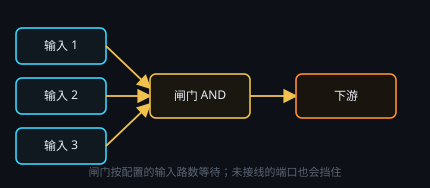

# 闸门、分发与互斥

控制类节点统一**金色外圈**，内部颜色仍表示种类。

| 节点 | 作用 |
| --- | --- |
| **闸门** | AND：配置了几路输入，就要几路脉冲到齐才放行（**没接线的端口也会挡住**） |
| **分发** | 一入多出，把脉冲送到多路 |
| **序列器** | 按顺序依次触发下游 |
| **计数** | 计满 N 次再放行 |
| **互斥** | 多路里按模式只放行一路（先到 / 端口优先 / 随机） |
| **需求等待** | 监视某个文件出现或变化后再继续 |

▶ 多为试跑 / 标记，具体见各节点指南。
