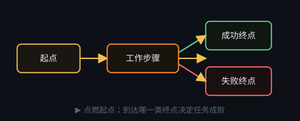

# 任务控制流

每个任务内部固定有：

1. **起点**（任务自动创建，不出现在添加菜单）
2. 中间的工作步骤、子任务、判断（是/否分流）
3. **成功终点 / 失败终点**

▶ 从起点沿控制线推进。到达成功终点即成功；失败终点或跑不下去则失败。父任务格子反映子任务状态。

判断节点根据「目标 / 标准」和已有结果让文本模型只答 YES/NO，再分流。需要已配置 API Key 的文本服务商。
