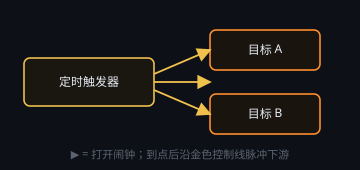

# 定时与延时

## 定时触发器

把闹钟连到要启动的节点（金色控制线）。间隔以**天 / 时 / 分**填写（最短 1 分钟，最长 7 天），也可用 Cron **智能填写**。

节点上的 **▶ 是打开闹钟**，不是「立刻跑一遍业务节点」。到点后向下游发脉冲。再点可关掉闹钟。

## 延时器

收到上游脉冲后等待设定时间，再放行。可用于拉开步骤间隔。

两种节点的端口含义以右键 **节点指南** 为准。
