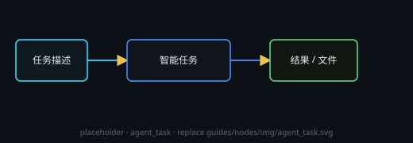

# 智能任务

通用 agent：按任务描述读文件、联网、执行命令，结果回填输出。服务商走 DeepSeek 路由。

## 端子
- **输入**：文本 / 引用
- **输出**：任务产物文本

## 运行显示
**思考与输出分开显示**：运行时按发生顺序分段 —— **「◉ 思考 · N 字」** 只折叠模型内部推理（N 只数思考的字数），中间步骤说出来的话以正常字号**正文**逐段显示，**🔧 工具**调用就近插在发生位置，错误以 ⚠ 附在正文里。每调用一次工具或进入新一步推理就另起一段；点节点头部的 **「◉ 思考」** 按钮可放大查看（上半思考、下半输出）。

## 许可
工具能力由顶栏「审批」预设控制。
