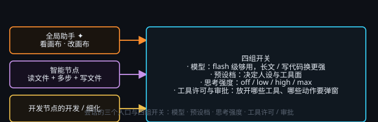

# 智能任务与智能会话

> 一句话目标：把会话的四组开关调到位、用上它的辅助功能，并绕开几个常见误区。

*图：会话的三个入口与四组开关——模型、预设档、思考强度、工具许可*

## 四组开关（模型 · 预设档 · 思考强度 · 工具许可）

- **模型**：flash 级够绝大多数活；长文推理、复杂抽取、写代码换更强的。
- **预设档**：决定 AI 人设、带哪些能力，开发任务一般使用「精简」。
- **思考强度**：off / low / high / max。越高通常质量越好、Token 越贵；日常 low 或 high 就够。
- **工具许可**：允许用哪些工具——读写文件、联网搜索、画布编辑、提问、识图。一般任务建议关闭识图，否则可能 AI 会频繁截图确认浪费 Token。

## 其他功能

- **思考翻译**：因思考大多数为英文，如果希望查看内容去溯源问题，可点击右侧的思考。该功能将调用无思考的 DeepSeek（默认）进行翻译。
- **工具参数显示**：会话中将显示工具调用日志，以及调用详细信息。
- **Token 报告**：最下方将显示本次会话的 Token 消耗报告，以及费用（仅限 DeepSeek）。注意该费用计算无法做到精准，最终请以官网统计为主。

## 常见误区

- 避免一个会话干所有事。上下文越多越杂，消耗越高越贵。尽量按任务拆分会话。
- **工具许可**：会话读不了文件 / 上不了网导致无法完成任务，可能是许可没开。
- **思考强度**：日常任务 low / high 足够，max 一般只在搭建新项目时会使用，涉及架构搭建时建议使用高端模型。
