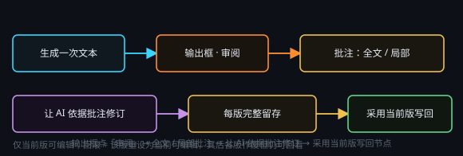

# AI 审阅：批注与修订

> 一句话目标：对已有文本做修改与审校——手动改，或按全局批注、局部批注让 AI 再编辑一遍。

*图：在输出框里点「审阅」，全文批注与局部批注都写在这里，再让 AI 依据批注修订*

## 文本编辑（审阅）· 节点说明

### 文本编辑（审阅）是什么

单次生成的文本内容很难完全满足要求，「审阅」可以让 AI 生成文本内容后，再次对已有文本进行手动修改、AI 全局编辑和 AI 局部编辑：用于纠错、润色、扩写、语法检查等等。

### 用法

在生成一次文本后，在右侧的输出框中点击「审阅」按钮进入审阅界面。全局批注用于总体修改意见；局部批注时，先点击上方「局部批注」按钮打开该功能，然后框选需要局部修改的内容即可。
