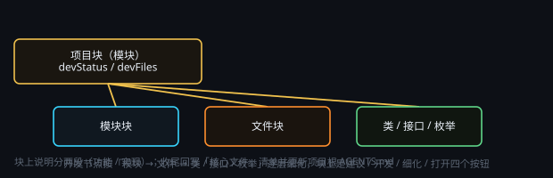

# 开发一个应用

> 一句话目标：把一个小工具做成能装进 MTNode 的「应用」——一个静态前端包（HTML / JS / CSS），「应用中心」里点开就是一个独立窗口。


*图：应用 = 静态前端 + 宿主能力桥；模型与工具留在主程序 / 画布一侧*

## 应用是什么

MTNode 里的「应用」是一份**纯静态**的 HTML / JS / CSS（外加图标、静态数据），没有任何 Node 依赖。
它由主程序用独立窗口装载，并注入一座能力桥（**appHost**）。

两种装载方式，桥的名字不同（脚手架两套都认，不必自己判）：

| 宿主 | 桥 | 装在哪 | 数据落哪 |
| --- | --- | --- | --- |
| **应用中心**（顶栏「应用」，用户自建 / 云端下载的应用） | `window.appHost` | 应用安装根目录 `<id>\`（「库」/「开发」页顶部可改） | `<数据目录>\apps-data\<id>\data.json`（可在窗口里改） |
| 插件窗口（插件目录里 `kind: "window"` 的卡片） | `window.pluginApi`（= `window.forumApi`） | `<数据目录>\app-plugins\<id>\runtime\` | `<数据目录>\app-plugins\<id>\data.json` |

**不要和本地后端插件混淆**：music3 / H3 / TTS / llama 这类卡片是**本地后端插件**（还有控制台窗与画布节点），是另一套更大的东西。

### 装在哪、跑在哪

| 位置 | 内容 |
| --- | --- |
| 应用安装根目录 `<id>\` | 应用静态文件（**升级 / 卸载 = 整目录替换，别往里写数据**） |
| `<数据目录>\apps-data\<id>\data.json` | 应用自己的数据（**默认数据根**，由能力桥原子写入） |
| `<数据目录>\apps-data\<id>\dataDir.json` | 该应用的数据文件夹指针（用户改过才有；改了不搬数据） |
| `<id>\installed.json` | 宿主记录的版本 / 入口 / 来源 / 来源作者 |

## 「库」与「开发」两个页签

应用中心分三页：**应用**（云端目录）、**库**（本机已下载、还没在开发的）、**开发**（正在开发的应用）。
两边名单**不重叠**，分界线是应用自己 `app.json` 里的一个标记位：

| 状态 | 真源 | 出现在哪 | 怎么进入 / 退出 |
| --- | --- | --- | --- |
| 已下载（没在开发） | `app.json` 没有 `dev:true` | 「库」页：运行 / 更新 / 📂 数据目录 / 二次开发 / 卸载 | 在「库」页这张卡片右侧点「**二次开发**」 |
| 开发中 | `app.json` 的 `dev: true` | 「开发」页：三栏开发台 + 启动 / 上架 / 打开画布 / 数据目录 / 卸载 | 开发页左栏底部「＋ 新建应用」新建，或从「库」二次开发 |

- **二次开发** = 登记为「开发中」+ 建一张**同名画布** + 在画布上建开发节点（应用目录一个字节都不搬）。
  执行完自动切到「开发」页并选中它。**本机已有同名画布时拒绝**并说清原因 —— 免得误覆盖。
  （库页顶栏只留「应用根目录」；数据目录与二次开发都收进每张卡片右侧的按钮。）
- 一次性回填：本次改动之前用「＋新建应用」建的应用（本机没有 `installed.json` 安装账本）会自动补上
  `dev:true`，不会凭空消失。
- **作者**：卡片 / 详情 / 库页行 / 开发页左栏的应用行都显示作者 —— 云端条目按发布账号，本机应用按 `app.json`
  的 `author`（没写过就按当前登录账号，未登录则不显示）。
- **开发页左栏 = 应用列表**：每个「开发中」的应用占一行（应用名 / 作者 / 会话数 / 展开箭头），它自己的会话
  折叠在这一行下面（已归档的会话不列，去会话页看）；点某一行就进入那个应用 —— 中栏预览与右栏会话一起切，
  回到开发页自动选上次打开的那个应用。搜索框同时搜应用名与会话标题；「＋ 新建应用」在左栏最底部
  （顶栏那条工具行不再放应用下拉框）。切应用时预览先盖一层黑幕、新页加载好再淡出（不再闪白）。
- **新开发会话 = 应用行右端那枚「＋」**：每行一枚，点它 = 切到这个应用并回到首轮态 ——
  接着在底部输入框写下本次开发需求、回车，就在**这个应用**下新建一条开发会话并开工（等同在该应用的
  开发节点上点「开发」并提交）；每行一枚，不用先切应用再找按钮。工具栏那一颗也是同一枚「＋」，
  作用 = 当前应用的快捷入口（窄到放不下时收进「更多 ▾」，那里带着「新开发会话」小标题）。
- **校验值收起来**：`sha256` 这类长串不再摊在界面上，详情里点「ⓘ 校验」小按钮看全文并可复制；
  应用 id / 作者 uid / 入口页 / 下载地址 / 窗口尺寸等收进默认折叠的「开发者信息 ▾」。
- 应用目录里的 `dev` 标记是**本机状态**：导出 zip 时会被去掉（下载的人装完照常列进「库」页）。

## 四条硬规矩

1. **纯静态**：只有 HTML / JS / CSS，资源一律相对路径（`./app.js`、`./assets/a.png`）。窗口里没有 `window.api`（那是主窗口的桥）。
2. **不依赖宿主也能跑**：能力桥可能不在（比如拿浏览器直接打开 `index.html`）。这时应用必须照常启动，功能降级、界面明说「数据不会保存」，而不是白屏。
3. **内容要落盘**：存档只走桥（`appHost.dataWrite` / 老桥 `dataSet`），**不要**用 `localStorage` 当存档、**不要**往应用目录写文件。
   自动存盘（脏标记 + 防抖）+ 关窗前强制冲刷，是脚手架 `store.js` + `close.js` 的默认行为。
4. **能调宿主才调，调不到就优雅降级**：不假装成功、不静默丢数据。

## 最小结构

```
my-app/
  index.html    入口（app.json 的 entry，默认 index.html）
  apphost.js    桥探测与降级（脚手架的 AppHost）
  store.js      内容落盘：脏标记 + 防抖自动存盘 + flush()
  close.js      关窗收尾：AppClose.on(cb) 登记，宿主关窗前跑完
  app.js        逻辑
  style.css     样式
  app.json      自描述元数据（标题 / 版本 / 窗口尺寸 / 入口）
  assets/…      图标等静态资源
```

`app.json` 与云端目录词条同口径（`id` / `kind: "window"` / `entry` / `version` / `title` / `subtitle` / `icon` / `window`），
真正生效的窗口尺寸与卡片信息来自**云端目录词条**，`app.json` 的作用是让整包自描述、便于本地开发与发布前自检。

## 宿主给应用的能力（appHost）

先探测再调用：`typeof host.dataWrite === "function"`，缺就走降级分支。脚手架已把这层包好（`window.AppHost.cap`）。

| 能力 | 应用中心窗口（`appHost`） | 插件窗口（`pluginApi`） |
| --- | --- | --- |
| 数据读写（整份） | `dataRead()` / `dataWrite(data)` | `dataGet()` / `dataSet(data)` |
| 数据文件夹 | `dataDirGet()` / `dataDirPick()` / `dataDirOpen()` / `dataDirReset()` | — |
| 账号摘要 | `account()` | `authGetState()` / `authMe()` / `onAuthChanged(cb)` |
| 创意工坊请求 | — | `storeRequest({ method, path, json })`（凭据由主进程带，窗口不接触 token） |
| 选图与图片缓存 | — | `pickImage()` / `compressImage()` / `cacheImage(id, base64)` / `readCachedImage(id)` |
| 窗口生命周期 | `close()` / `quit()` / `onWillClose(cb)` | `close()` / `onShown(cb)` |

### 正确关闭（所有应用都要）

关闭按钮接 `AppHost.close()`。宿主**不会**直接销毁窗口：它先发 `apps:willClose`，等应用把 `AppClose.on(...)` 登记的收尾动作跑完
（上限 1.5 秒）才真的关；主程序退出（`before-quit`）走的也是同一条。所以「写盘 + 退订」挂进 `AppClose.on` 就够了。
`AppHost.quit()` 是「连 MTNode 一起退出」，只在应用自己带退出按钮时用。

### 数据文件夹（所有应用都要）

- 默认落 `<数据目录>\apps-data\<id>\`（跟着 MTNode 的数据目录走，不跟着应用安装目录走）；
- 用户可以在**应用窗口里**（或应用中心「库」页那一行）改成自己的文件夹 —— 路径**只能来自用户在系统目录框里亲自选的那一次**，应用自己传不了路径；
- 「更改」**不搬旧数据**：新目录当场生效，旧目录的文件原样留着；「恢复默认」只删指针，也不删文件；
- 宿主只允许写「默认数据根 + 用户选过的那个文件夹」，文件名限 `data.json`（老名字 `store.json` 兼容），一律原子写（tmp + rename），整份上限 2MB。

## 模型 API 与工具不在应用窗口里

这一点最容易踩：**应用窗口拿不到模型 API，也拿不到 MTNode 的工具**（没有 `chat` / `generateText` 这类接口，也没有「服务端 LLM 补全」路由）。

- 提示词 / 文案类小工具：应用只负责拼提示词与界面，生成交给**画布工作流**（文本处理、图像生成、智能节点），或交给全局助手 ✦。
- 应用必须内建 LLM / 图像 / 语音能力：升级为**本地后端插件**——主进程复用「设置 → 模型服务」里的模型 Key 调模型，再由自己的控制台界面使用。

## 从零做一个应用

1. 复制随包脚手架 `templates/app-scaffold/`（`index.html` + `apphost.js` + `store.js` + `close.js` + `app.js` + `style.css` + `app.json`）
   到该应用的源码目录。
2. 替换占位符：`app.json` 的 `id` / `title` / `subtitle` / `icon` / `version` / `window`；`index.html` 的标题、文案与图标字符。
3. 在 `app.js` 里写真正的逻辑；数据一律走 `Store`（内部是 `AppHost.getData` / `setData`），**不要**用 `localStorage` 当存档、不要往应用目录写文件。
4. `frame:false` 的窗口没有系统标题栏，必须自己留一个关闭按钮接 `close()`（脚手架已接，并把写盘挂在关窗收尾上）。
5. 打包：把应用目录打成 zip（根目录就是应用目录）→ 上传 → 云端目录词条补 `zipUrl` + `sha256` + `entry` + `window`。
6. 验证：安装 / 更新 → 打开窗口 → 改一条内容 → 关掉再开（内容还在）→ 改数据文件夹（数据跟着走、旧目录还在）→
   用浏览器直接打开 `index.html` 仍可用（降级提示可见）→ 数据落在 `<数据目录>\apps-data\<id>\data.json`。

## 常见错误

| 现象 | 原因 | 处理 |
| --- | --- | --- |
| 窗口打开是白屏 / 一片透明 | 资源用了绝对路径（`/app.js`），或没自己画背景（窗口默认透明） | 全改相对路径；给根容器画背景与圆角 |
| 界面按钮点了没反应 | 按钮落在拖动区里（`-webkit-app-region: drag`） | 给按钮加 `no-drag`（`-webkit-app-region: no-drag`） |
| 关不掉窗口 | `frame:false` 且没做关闭按钮 | 加按钮 → `AppHost.close()`（老桥 `pluginApi.close()`） |
| 数据重启就丢 | 用了 `localStorage`，或宿主不可用时假成功 | 存档走 `Store` / `dataWrite`；宿主不可用时界面明说「不会保存」 |
| 关了窗口最后一条内容没了 | 直接 `close()` 而没冲刷 | 把 `store.flush()` 挂进 `AppClose.on(cb)`（脚手架 `close.js` 已做） |
| 从 iframe 里调宿主失败 | 能力桥只注入顶层文档 | 由顶层调宿主，再把结果 `postMessage` 给 iframe |
| 应用里读写本机文件失败 | 应用窗口没有 Node 与文件能力 | 需要文件 / 目录能力时升级为本地后端插件 |
| 换台机器 404 | 资源写了盘符或 `..` 路径 | 资源只放应用目录内，用相对路径引用 |

## 下一步

- 想做带后端 / 控制台 / 画布节点的插件：那属于「本地后端插件」（见内置技能 `mtnode-plugin-dev`），不是应用。
- 想让 AI 帮你把这个应用写完：在「应用中心 → 开发」左栏点中这个应用，在右栏会话里说一句话；或把需求交给全局助手 ✦，并说明「按内置技能 mtnode-app-dev 的契约来写，从 templates/app-scaffold 复制起步」。