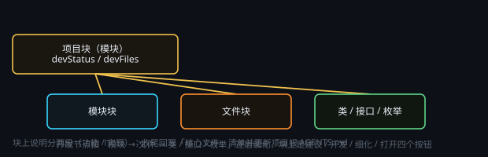

# 开发节点：让 AI 写项目

> 一句话目标：把软件项目拆成画布上的一颗颗功能块，再用四个按钮逐块把设计落成真实代码。

*图：开发节点把项目拆成功能块，块上四个按钮分别是建议 / 开发 / 细化 / 打开*

## 开发节点总览

开发节点 = 把「软件项目」拆成画布上的一颗颗功能块（超级节点），每颗块负责一个模块 / 文件 / 类。

开发节点中可看到该模块的设计说明；点开卡片上的按钮，可以让 Agent 去调研、开发或细化。

- **开发** = 按你选定的方案真正动手建目录、写文件、跑验证。
- **细化** = 把这块功能继续往下拆（模块 → 文件 → 类 / 接口 / 枚举）。
- **打开** = 文件节点专有，直接打开或执行该文件。

### 使用方法

1. 块上说明分两段：「功能」为简要易懂的功能说明，「实现」则是相对准确的实现方法。
2. 从上而下搭建整棵架构，再逐块生成开发节点。
3. 在正确的节点上进行「开发」可能会节省 Token 和 AI 搜索项目的时间。

### 项目目录

在画布左侧边栏，可以切换为「文件」，切换后将可以访问画布目录或项目目录的内容，并且允许查看和编辑。

## 节点说明

### 是什么

开发节点是带「开发」标记的超级节点：外观和普通超级节点一样，内部是「这个模块干什么、怎么实现、涉及哪些文件」。

### 为什么用它

- 作为人和 AI 交互的锚点：讨论或修改项目代码时可不用语言来描述目标功能块。
- 一块一会话：每块的调研 / 开发都在自己绑定的会话里跑，上下文互不污染。
- 可以按图施工：块上填好模型、预设、思考强度，点「开发」就按这张图开工。

### 适合的场景

新项目从零搭架构、老项目逆向梳理、把一个大需求拆成能并行开发的模块。

### 不适合的场景

只写十几行的脚本、或纯文案任务——直接开一个会话更快，不必建块。

## 四个按钮与工作流

### 开发

按你确认的方案真正动手：建目录、写文件、跑验证，产物落在本块的「项目根目录」。

### 细化

把当前块往下拆一层。可调整下钻深度。

### 打开

只有文件节点有：在应用内的 Markdown 阅读器里查看 / 编辑本块文件。

### 推荐动线

1. 按确认后的架构逐块「开发」。
2. 每块做完「细化」露出它的文件与类。
3. 收尾回写「核心文件」清单、更新 AGENTS.md。

## 共识文件

### AGENTS.md 共识文件

在项目根生成一份共识文件。AGENTS.md 包含目录约定、不要修改清单以及所有需要 AI 全程遵守的约束，项目内每个会话开工前都会读它。第一层开发节点中一般会生成 agent.md 的入口文件节点，可以直接在应用内阅读 / 编辑 / 保存。

### 回写纪律

每个功能块收尾都要在「核心文件」里补写本模块真实产出的文件（最多 10 条、相对项目根）。

### 不确定或目标模糊时

模块取舍、技术选型这类问题，开发前 AI 会先询问你。在进行复杂任务开发时，也会先列出详细的开发任务清单。

## 配置速查

- **项目根目录**：项目根的绝对路径。最外层块填一次，子块就近继承；项目根就是 Agent 的工作区根。
- **所属上层**：这块挂在哪一层，由它所在的超级节点决定。
- **元素类型**：模块 / 文件 / 类 / 接口 / 枚举，决定块的性质。
- **模型 + 路由**：本块会话用哪个模型（建议 / 开发 / 细化都用它）。
- **预设档**：极简模式 / 标准模式 / 思维精简 / PTC 模式 / 创造模式，决定人设与工具面。
- **思考强度**：轻 / 标准 / 强 / 最强 —— 界面回显即实际下发。
- **外框颜色**：按功能色卡取：核心运行时 / 画布与交互 / AI 与 Agent / 数据与存储 / 媒体与本地后端 / 插件与生态 / 构建与诊断 / 测试与质量。
- **状态**：待开发 / 进行中 / 已完成，标记块进度。
- **核心文件**：本块核心文件清单（≤10 条、相对项目根；最外层项目块不填）。
- **关系线**：块与块之间的调用 / 依赖用关系线表达，它不传数据、不参与执行。

## 从哪开始

### 从零开始一份新项目

1. 在画布点击右键，告诉右侧栏助手你的目标：「用 X 语言做一个能做 Y 的东西，帮我搭开发节点架构」——不确定的地方它会先问你。
2. 助手扫一遍目标 / 现有目录，先给出覆盖全项目的架构骨架（顶层项目块 + 各模块块）和项目根的 AGENTS.md。
3. 你逐块点「建议」看方案、点「开发」开工；每块做完点「细化」往下钻一层。
4. 每块收尾检查两件事：「核心文件」清单是否写了、AGENTS.md 是否更新。

### 从已有项目开始

在画布点击右键，选择「构建工作流」，使用「开发节点架构师」并写入项目目录，由 AI 进行目录扫描，它会按真实目录结构生成功能块（模块 → 文件 → 类），标注每个块的职责与核心文件。
