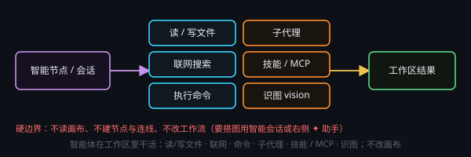

# 智能能力是什么

接入 DeepSeek Harness（dsh）后，模型不只生成文字，还能**读/写工作目录文件、联网搜索、执行命令、派子代理**。运行时随应用自带，**不用另装 Node**。

需要先配置带 API Key 的**文本服务商**。智能任务、智能会话、对话节点的「智能助手」、文本处理的「🐋 智能」都走这条引擎。

## 过程可见

运行中显示「◉ 思考中」，可展开思考与 **🔧 工具调用**。智能模式按任务完成计费，一次任务可能多次调用模型。

写文件前请确认 [工作目录](#workspace) 正确。权限过宽或过严见 [审批与权限](#approvals)。
