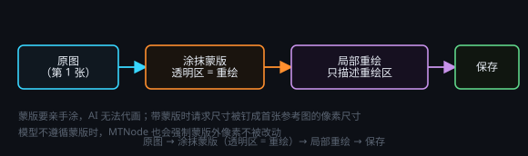

# 图像编辑与蒙版

> 一句话目标：对已有图像做局部修改——涂出要重绘的区域，只让模型改这一块，其余像素在生成时保持不变。

*图：涂出重绘区（透明区 = 重绘），提示词只写这块区域要出现什么*

## 图像编辑（蒙版）· 节点说明

### 图像编辑（蒙版）是什么

图像生成节点除了整张重画，在模型允许蒙版编辑时可以只改一小部分：在节点上涂抹出要重绘的区域（蒙版），其余像素在生成时将保持不变。该功能并非每个模型都支持，但是即便不支持，MTNode 会对蒙版外内容进行固定，也可能达到需要的效果。

### 怎么用

1. 上游接一张图像（输入节点 / 素材 / 上一张生成结果）。
2. 打开节点上的「蒙版」开关。
3. 在节点头部的蒙版编辑器里涂抹要重绘的区域（透明区 = 重绘区）——蒙版要亲手涂，AI 无法代画。
4. 提示词只写「这个区域要出现什么」，不要重新描述整张图。
5. 尺寸：带蒙版时请求尺寸会被钉成首张参考图的像素尺寸，节点自己选的尺寸这一轮不生效。
6. 只对第一张参考图生效，建议尺寸与模型适配的尺寸一致。
7. 模型不一定每次会遵循蒙版，MTNode 进行了强制非蒙版区域像素不允许改动的后处理。

## 图像编辑（蒙版）· 操作步骤

### 典型场景

- 换掉局部：换一件衣服、把背景里的杂物擦掉换成墙面。
- 加一处元素：在桌面加一杯咖啡、给招牌补一行字。
- 修瑕疵：修掉多余的手指、反光、水印。

### 提示词模板

只描述重绘区，例如「一件米色针织开衫，正面平铺，柔和均匀打光」；不要写「整张图是…」。

### 相邻功能：透明背景

如果模型支持，可直接在模型选择部分打开「背景 - 透明」（例如 GPT-Image-2.5 支持透明背景）。否则需打开「透明背景」开关，使用差分算法进行生成（需消耗 2 倍 Token）。
