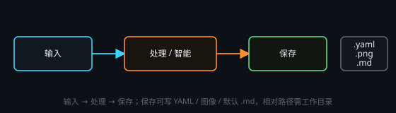

# 输入 / 处理 / 保存

## 输入

- **文本**：就地编辑；📄 可导入 txt / md / json / yaml 等（超过 500KB 拒绝）。
- **图像**：点击选择或拖入文件。

## 处理

- **文本处理**：提示词 + 输入调用 LLM。可开「🐋 智能」变成任务（见 [智能任务](#agent-nodes)）。
- **图像生成**：文生图；带参考图走图生图。需要视觉时请勾选服务商「支持视觉」（DeepSeek 官方不识图）。
- **动画**：把图像按网格切成 GIF 帧，可设透明色键。

**▶ 运行 · ◈ 预览完整请求 · API** 选服务商 / 模型 / 温度 / 尺寸。**多次尝试**（1–10）并行抽卡，输出面板用方块 Tab 切换，下游引用当前选中的那次。处理完成后自动跑下游；下游已有内容时询问覆盖或不继续。

输出头上的「浏览 / 复制 / 清空」可大窗查看或重置。

## 保存

指定路径后 ▶ 写出 YAML 或图像。可勾选「输入变化时自动保存」。有工作目录时可用相对路径，见 [工作目录与存档](#workspace)。
