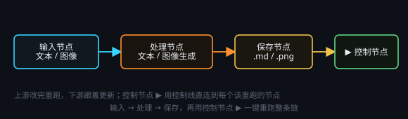

# 输入 / 处理 / 保存

> 一句话目标：① 文本 · ② 图像两组内容生成节点——每组含节点说明与多种用法，产出接「保存」节点落盘。

*图：输入 → 处理 → 保存，再用控制节点 ▶ 一键重跑*

## 文本生成 · 节点说明

### 是什么

文本处理是画布上最常用的生成节点：把上游的文字（提示词、文章、表格内容）交给大模型，输出新的文字。

### 两个模式

- **普通模式（默认）**：一次请求换一次结果，稳定、便宜，结果可直接接「保存文本」落盘。
- **智能模式**：把这个节点当成一个小 Agent，它能自己读文件、写文件、多步完成任务；因为会自己读写，后面一般没必要接「保存」节点。

### 关键参数

- **提示词**：写清「要做什么 + 输出什么内容」，可以用 `@节点标题` 引用上游连接的内容。
- 点击上方设置可以更换模型，上方的**思考强度**按钮可以修改模型的思维链长度，越高的思维链一般输出内容质量越高，但 Token 消耗会越大。实际应用中一般用低或高即可。
- **服务商 / 模型**：绝大多数任务选择 flash 级模型就够；长文推理、复杂抽取可换更高级模型。

### 建议

- 一般类型的 AI 问答或是求解，建议直接访问免费的 Deepseek 网页：https://chat.deepseek.com 。不过通过 API 调用的简单文本生成一般也非常便宜，最多几分钱。
- 提示词越具体越稳：带上角色、任务、格式、长度限制，效果好过「帮我写一下」。

## 文本生成 · 多种用法

- **用法 1 · 润色与改写**：上游接一段原文 → 提示词「把下面的文字润色成口播稿，保留全部事实：@原文」→ 输出接「保存文本」。
- **用法 2 · 翻译**：提示词「把 @中文 翻译成英文，只输出译文，不要解释」，结果存 `.txt` / `.yaml`。
- **用法 3 · 结构化提取**：提示词「从 @正文 里抽出人名、地点、时间，输出 YAML」→ 输出可被下游节点直接解析。
- **用法 4 · 模板约束输出**：提示词里给 JSON / YAML / Markdown 模板，让模型按模板填空，方便程序处理。
- **用法 5 · 智能体模式（点击启用鲸鱼图标）**：需要查资料、读多个文件、写一份完整文档时开启该模式；产出一般是文件。

点击绿色三角【播放】按钮启用节点。

## 图像生成 · 节点说明

### 是什么

图像生成节点用来出图和改图：文生图、图生图、局部重绘、透明底成品，都在同一个节点上完成。

### 最重要的一条

每次运行只出 1 张图。要 10 张就准备 10 条输入（批量 1:1）、或放多个图像生成节点、或用「抽卡次数」多抽几次；绝不要在提示词里写「生成多张」。

### 关键参数

- **尺寸**：从画布可选尺寸里挑 —— 竖版 `848x1280` / 人物立绘，方图 `1280x1280`，横版 `1280x848` / 封面，高清 `2048x1360`。
- **质量**：默认（不传）/ auto / low / medium / high / xhigh / max，草稿试风格用 low，成品用 high 以上。
- **背景**：默认（不传）/ auto / 不透明 opaque / 透明 transparent（直出带透明通道的 PNG）。
- **服务商**：必须是「图像 OpenAI 兼容」类型的服务商（例如 GPT Image 2）；文本服务商不能出图。

### 提示词结构

主体 + 外观细节 + 动作表情 + 环境背景 + 光线 + 镜头 + 画风 + 画质词。

## 图像生成 · 多种用法

- **用法 1 · 文生图**：上游接一段提示词 → 输出接「保存图像」，自动存成 `.png`。
- **用法 2 · 图生图**：把参考图（图像输入节点，或上游刚生成的图）连进它的图像端子，提示词写「保持主体与构图，把背景换成…」。
- **用法 3 · 局部重绘（蒙版）**：打开节点头部的「蒙版」，在蒙版编辑器里亲手涂出要重绘的区域（透明区 = 重绘），只对第 1 张参考图生效；这一轮尺寸会跟随参考图。
- **用法 4 · 透明底成品**：做贴纸 / 图标 / 精灵 / 立绘抠图：打开头部按钮「透明背景（双通道差分抠图）」（内部先出黑底基准、再差分出带透明通道的 PNG，约 2 倍消耗），或把「背景」选成「透明 transparent」。
- **用法 5 · 批量出图**：图像输入节点一次选多张图并开启「批量模式」，图像生成节点也开「批量模式」逐条跑，1 条 = 1 张，接「保存图像」批量落盘。
- **用法 6 · 多轮迭代**：同一张图反复「图生图 + 局部重绘」，一步步改到满意，比一次写超长提示词更可控。
