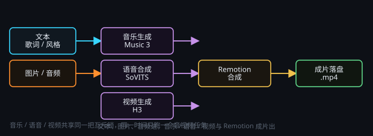

# 出音乐 / 语音 / 视频

> 一句话目标：③ 音乐 · ④ 语音 · ⑤ 视频 · ⑥ Remotion 合成四组内容生成节点——每组含节点说明与多种用法，音乐 / 语音 / Remotion 另附接线与参数速查。



*图：素材进、成片出——音乐、语音、视频与 Remotion 合成共用一条线*

## 音乐生成 · 节点说明

### 音乐生成是什么

调用 MiniMax Music 3 生成整首歌或纯音乐，产出一个音频文件。

同一条「音频生成」菜单里还有 **YuE2** 节点（本地 YuE2 后端，**歌词 → 整曲**，另带可手写的 **ABC 谱面**）：想把歌词直接唱成完整歌曲、或要自己改谱面时用它，同样需要 24G 显存级别的 NVIDIA 显卡；写法与后端安装详见节点指南 `yue_gen`。

### 前提

需要先在本机安装并启动 MiniMax Music 3 后端（建议显卡 24G 显存级别）；后端没起来会直接报错。在上方菜单栏的插件中可打开进行安装配置。

### 关键参数

- **提示词**：只写曲风 / 情绪 / 乐器 / 编曲 / 人声特点，不要把歌词写进来。
- **歌词**：单独填在歌词栏；留空 = 纯音乐 / 器乐。
- **输出路径**：节点直接把音频写到这个文件，不需要再接「保存」节点。
- **抽卡次数**：1–10，多抽几条挑最好的一条；种子每次 +1。
- 时长与段落结构由模型根据歌词和提示词决定。

## 音乐生成 · 多种用法

- **用法 1 · 一首完整歌曲**：歌词按结构标签写：[Intro] [Verse] [Pre-Chorus] [Chorus] [Bridge] [Outro]；每行 12–20 字、押韵，副歌重复同一句钩子；提示词只写风格（例：city pop，清澈女声，复古合成器，中速）。
- **用法 2 · 纯音乐 / BGM**：歌词留空，提示词写「轻快的钢琴与弦乐，无人声，适合视频背景音乐，情绪温暖」。
- **用法 3 · 抽卡选优**：抽卡次数设 3–5，跑完对比几条输出，保留最好的一条。
- **用法 4 · 批量做系列**：用一个文本节点列出多组「风格 + 歌词」，开启「批量模式」逐条生成，每条写不同的输出路径。
- **用法 5 · 配乐 + 配音组合**：先用音乐生成出背景乐、再用语音合成出旁白，最后在视频合成节点里对轨。

**注意**：全局同一时间只跑一个音视频任务：音乐生成 / 语音合成 / 视频生成共享同一把互斥锁。

**消耗时长参考**：4090，74 秒花费 8 分 30 秒。

## 音乐生成 · 接线与参数速查

### 接线

```
文本(歌词) ─┐
文本(风格) ─┴→ 音乐生成节点 → 音频文件（节点自带「输出路径」）
```

不需要接「保存」节点：音频由节点自己的输出路径直接写出。

### 参数速查

- **输出路径**：`…/assets/music/曲名.mp3`（`.mp3` / `.wav`）
- **抽卡次数**：1–10，建议 3–5 抽
- **歌词栏留空** = 纯音乐
- **后端**：MiniMax Music 3（本机 24G 显存，需先安装并启动）

## 语音合成 · 节点说明

### 语音合成是什么

语音合成把文字转成语音，基于 GPT-SoVITS 本地后端，输出 `.wav` 音频。

### 关键参数

- **音色**：本机音色库里已有的音色名，需提前进行训练。
- **语速**：0.5–2.0，1.0 是原速。
- **输出路径**：节点可直接写入文件。
- **抽卡次数**：同一段可以多抽几次，挑最自然的一条。

### 前提

先安装并启动 GPT-SoVITS 后端；音色要提前在音色库里准备好（可以使用提供的音频进行训练）。

### 建议

一般情况建议使用例如 B 站的必剪等软件进行免费的语音合成。但本地的语音合成允许你使用任何音频训练自己的模型，并可用于在程序中实时流式生成为文字配音。

## 语音合成 · 多种用法

- **用法 1 · 短视频口播**：上游接文本节点写好的解说稿 → 语音合成。
- **用法 2 · 多音色对话**：把剧本按角色拆开，分别接不同音色的语音合成节点，得到一问一答的对话音频。
- **用法 3 · 语速微调**：科普、营销类 1.1–1.2 稍快更精神；抒情、旁白类 0.9 更耐听。
- **用法 4 · 先改稿再配音**：文字先让文本节点按「适合朗读」的短句改写，再进行语音合成，断句会自然很多。

**注意 1**：与 音乐/视频生成 共享同一把互斥锁，一次只跑一个。

**注意 2**：第一次跑因为需要载入模型所以时间较长，但后续应当是非常快的。

**注意 3**：生成有电音一般是输入音频采样率太低，建议使用 32k 采样率。

## 语音合成 · 接线与参数速查

### 接线

文本(台词) → 语音合成 → 音频文件（节点自带「输出路径」）

### 参数速查

- **音色**：本机音色库里已有的音色名（留空 = 默认）
- **语速**：0.5–2.0（口播 1.0–1.2，抒情 0.9）
- **输出**：`…/assets/tts/第01段.wav`（`.wav` / `.mp3`）
- **后端**：GPT-SoVITS 本地 TTS，需先安装并准备音色

### 排错

- 声音发虚 / 破音 → 换音色或降语速
- 长文卡住 → 先拆分再逐段合成
- 后端未启动 → 先去设置里启动 TTS 后端

## 视频生成 · 节点说明

### Minimax H3 视频生成节点是什么

视频生成用 MiniMax H3（ComfyUI 后端）生成视频片段，输出 `.mp4`。

### 两种模式

- **FL2VA 首末帧**：给首帧图、可选末帧图，中间运动由模型补全，控制画面起点与落点。
- **R2V 多参考**：给多张参考图控制角色长相与场景，做角色一致性。
- 需要在插件界面进行启用。

### 自建 ComfyUI 工作流（含「南风H3 V10 多参」）

除了内置两条链，视频生成节点还能跑**自己搭的 ComfyUI 图**：节点头部 **⚙ 设置 → 工作流来源** 选「自建 ComfyUI 工作流」，
在 H3 管理窗口的**自建工作流库**里导入（拖 JSON / 粘贴 JSON，API 与 UI 格式都能识别）。库里的第三条模板
「**南风H3 V10 多参（模板）**」来自第三方节点包 `nanfeng_prompt_nodes_v10`：一个节点就是整条多参生成管线
（最多 9 张图 + 3 段视频 + 3 段音频参考），随包分发、装 H3 时自动部署。

- 参数：图里被「提升为节点参数」的字段各占一个端子——**端口 1 = 文本 · 端口 2+ = 素材**；南风节点的中文控件（提示词 / 图片N / 视频N / 音频N / 时长秒）已能被正确识别。
- **限制**：MTNode 只向 ComfyUI 发 `/prompt`，**不加载该包的界面与后端路由**。所以它的素材卡、**音频驱动、智能分镜、锁音频、二采**等特性在 MTNode 侧**暂不可用**，需要额外的桥接才能用。
- 安装前提：`ComfyUI/models/latent_upscale_models/` 里**至少要有 1 个文件**（该字段是必填下拉，空列表会被 ComfyUI 拒单）；并且**不要开「CPU VAE」**，南风 H3 的 VAE 解码在 CPU VAE 下会报 dtype 错。

### 关键参数

- **时长**：4–15 秒。
- **分辨率**：auto / 480p / 720p，建议使用 480p。
- **帧率**：24 / 30 / 60。
- 生成链**只出原生片**，不再内联跑超分 / 补帧——后处理已拆成两个独立节点（见下）。

### 超分 / 补帧（独立节点）

生成完再用两个独立节点按需加工，二者互不绑定，可单独用也可串联：**Minimax H3 → 视频超分 → 视频补帧**。

- **视频超分**（处理节点 › 视频生成 › 视频超分）：Real-ESRGAN x4 逐帧放大 → 缩放到目标长边（默认 3840 = 4K）。
- **视频补帧**（处理节点 › 视频生成 › 视频补帧）：RIFE 按倍数插帧，fps 按倍数重算（2x / 4x）。
- **24G 显存建议**：超分保持「低显存安全档」（逐帧 `per_batch=1`）+ 长边 3840；补帧用 **2x + 安全档**，要 4x 就先补到 2x 再串一个补帧节点。峰值主要由单帧解码与模型决定，与片段长度无关；某一档真超限时后端会**自动降一档重试一次**，并把结果写在节点状态行上。
- 两者都自带输出路径（`.mp4`），一次只出一个文件，与音乐 / 语音 / 视频共用同一把音视频互斥锁。

### 前提

先安装并启动 H3 后端，显存 24G 级别。生成失败先降分辨率、缩短时长。

## 视频生成 · 多种用法

- **用法 1 · 首末帧过渡**：首帧、末帧各给一张图，模型补中间运动：适合变装、转场、镜头推进、四季变化。
- **用法 2 · 多参考图保角色一致**：角色设定图 + 场景图一起作为参考（`r2v`），同一角色跨镜头长相稳定。
- **用法 3 · 长片拼接**：一个长镜头拆成多个 4–8 秒片段分别生成，再剪辑串成成片。
- **用法 4 · 短素材镜头**：只给一张起手图 + 文字描述（`fl2va` 只填首帧）。
- **用法 5 · 图音对齐**：先出语音音频，按音频时长决定每个镜头的时长，画面与声音才对得上，此模型不支持音频输入。

**注意**：显存互斥：与 音乐/语音生成 不能同时跑，会自动排队。

### 接线

`fl` 首尾帧（一般质量好一些，但不支持音频）：图像(首帧) + 图像(末帧) → mp4 视频

`r2v` 多张参考图：图像 / 音频 → mp4 视频

### 排错

- 显存不足：降分辨率、缩短时长，或把超分 / 补帧各自单独跑；同一时间只能跑一个音视频任务。
- 效果差：重跑两次，但本身本地模型效果就比不上云端模型。

## Remotion 合成 · 节点说明

### 是什么

Remotion 节点用代码化的方式合成视频：字幕、图文卡片、数据动画、片头片尾模板。它比逐帧 AI 生成更快更稳，可以精确控制每一帧。

### 关键参数

- **分辨率**：`1920x1080`（横版）、`1080x1920`（竖版）、`1080x1080`（方版）。
- **帧率**：24 / 30 / 60。
- **时长**：1–60 秒。

### 落盘方式

它没有自己的输出路径：把 mp4 交给下游的「保存」节点，路径以 `.mp4` 结尾即可。

### 适用场景

把 AI 生成的零散素材（文案、图片、配音）组装成最终成片，是整条内容流水线的收尾环节。

## Remotion 合成 · 多种用法

- **用法 1 · 字幕视频**：把语音合成的音频 + 逐句字幕接进来，合成带字幕的口播视频。
- **用法 2 · 图文卡片 / 幻灯片**：把拆分后的文案逐条喂进来，配背景图与转场，做知识卡片视频。
- **用法 3 · 数据动画**：把表格或统计结果做成条形图、数字增长的动画。
- **用法 4 · 片头片尾模板**：固定模板 + 可变标题文字，批量生成系列片头。
- **用法 5 · 素材汇总**：把多个 AI 视频片段按序拼接、加转场与片尾，输出完整成片。

**注意**：它拿的是「脚本 + 素材」，素材本身要先用 图像 / 语音 / 视频 节点准备好。

## Remotion 合成 · 接线与参数速查

### 接线

文案 / 图片 / 音频 → Remotion 合成 → 保存(.mp4)

### 参数速查

- **分辨率**：`1920x1080` / `1080x1920` / `1080x1080`
- **帧率**：24 / 30 / 60
- **时长**：1–60 秒
- 没有自己的输出路径，必须由下游「保存」节点落盘，路径以 `.mp4` 结尾

### 适用

字幕视频、图文卡片、数据动画、片头片尾模板 —— 比逐帧生成更快更稳。

## SenseNova 图像生成 · 节点说明

### SenseNova 图像生成是什么

在**你自己电脑上**做文生图的节点：本机 SenseNova-U1.5-8B-MoT 后端（商汤「日日新」原生统一多模态权重，对照开源项目 [OpenSenseNova/SenseNova-U1](https://github.com/OpenSenseNova/SenseNova-U1) 移植），给一段提示词出一张 `.png`，最高原生 4K。入口在画布右键 **处理节点 › 图像生成 › SenseNova**，节点指南见 `sensenova_gen`。

端子语义与输出形态跟云端「文生图」节点（`proc_image`）**完全一致**——输出 0 = 图像、输出 1 = 控制，下游的图像预览 / 保存 / `@` 引用一条都不用换，可以直接把画布上已有的云端文生图节点换成它。**两者都不需要设置输出路径**：生成结果自动进入应用资产目录，从节点输出端子（端口 0，图像）交出去，下游直接接 `save_image` / 预览即可（旧画布残留的 `outputPath` 会被忽略）。

### 与云端「文生图」节点怎么选

| | SenseNova（本机） | 文生图（云端服务商） |
| --- | --- | --- |
| 提示词去哪 | 只在本机，不上传 | 发给服务商 |
| 花费 | 一次性装环境（约 40GB 下载） | 按张计费 |
| 分辨率 | **只有官方 11 个训练桶**，最小也是 2048×2048 | 尺寸自由（含 `auto`） |
| 是否需要设置输出路径 | 不需要：出图自动进应用资产目录，从端口 0 交出 | 不需要：出图自动进应用资产目录，从端口 0 交出 |
| 参考图 / 局部重绘 / 透明抠图 | **参考图支持**（连图即图像编辑，走 `it2i_generate`）；蒙版局部重绘 / 透明抠图仍不支持 | 支持（图生图、蒙版、画幅锁定、差分抠图） |
| 硬件前提 | 一张 NVIDIA 卡（24G 官方档）+ ≥40GB 内存 | 无，只要有网 |
| 单张耗时 | 首张约 1 分钟（含约 28 秒权重加载），之后每张 20 秒起（4090 · 2048² · 4 步；步数越多越久） | 十几秒到一分钟 |

**一句话**：要参照图改造、要抠透明底、要批量跑很多张、或机器没 N 卡 —— 用云端 `proc_image`；要离线、不想按张花钱、追求本地可控与高原生分辨率 —— 用 SenseNova。

**连一张图进去就是图像编辑**：把图像节点接到 SenseNova 节点的数据槽（或用 `@` 引用 / 全局广播取到图），本次生成会自动切成图像编辑模式——那些图作为**参考图**随请求下发本机后端参与条件（换风格、改局部、照参考图构图）。读不到的参考图会在节点状态行与警告里逐条说明，不会静默丢弃；一张都取不到就退回纯文生图。对应的参数是设置窗里的**「参考图条件强度」**（`img_cfg_scale`，1.0 = 关闭图像 CFG 即官方默认，1.5–2.0 更贴参考图）。

### 前提（装 / 启停 / 硬件）

先安装并启动后端：顶栏 **插件 › SenseNova 本地图像生成** → 控制台里选安装目录 → **安装**（可重复执行、断点续跑）→ **启动**。装完节点即可出图；没装时节点显示「插件未安装」警示条，点 ▶ 会直接中止并给安装入口，**不会静默降级**。

- **显卡**：需要 NVIDIA 卡，**24G 显存为官方推荐档**，20G 起勉强可跑，<20G 直接拦死（权重 bf16 约 **32.66GB**，靠官方分层卸载跑进一张 24G 卡；官方档位是 `fast`）。**实测 4090 上 `fast` 峰值约 16GiB**（换更大的桶也只涨一点），所以 `fast` 就是默认档；`low` 档峰值仅约 3GiB 但慢约 2.4 倍。
- **实测耗时**（4090 · bf16 · `sdpa`，`/generate` 全程）：2048×2048 / 4 步 `fast` = **首张约 63 秒**（含约 28 秒权重加载）→ **第二张约 24 秒**；2048×2048 / 12 步 + think ≈ **6.5 分钟**。**第一张明显慢**（冷启动）属正常，第二张起就快了。
- **内存**：建议 **≥40GB**（分层卸载出去的权重要放在内存里，32GB 是硬门槛）。
- **磁盘**：**建议预留 ≥60GB**（权重约 32.66GB + CUDA 版 torch 运行时 + 源码包）。
- **安装源**：全程走国内镜像（SJTU / 阿里云 / 清华 PyPI / ModelScope / GitHub 代理），不翻墙也能装；权重从 ModelScope 下，失败自动回退 `hf-mirror`。
- **启停**：正常由 MTNode 自动启停（首次生成时才拉起，空闲自动释放）；手动入口在插件的 `start_backend.cmd`，端口 **8774**。装坏 / 跑挂会弹错误报告并提供「🤖 自动修复」。
- **省显存 / 省时间**：降「采样步数」或降「显存档位」（`fast` → `balanced` → `low`）；**降分辨率没用**——最小桶也有 2048×2048（≈400 万像素）。
- **不要并行**：全局同一时刻只允许 1 个音视频任务，且它与 H3 视频 / Music3 / YuE2 抢显存，24G 卡上务必串着跑。

### 关键参数速查

- **分辨率桶**：`1:1` 2048×2048 · `16:9` 2720×1536 · `3:2` 2496×1664 · `4:3` 2368×1760 · `2:3` 1664×2496 · `3:4` 1760×2368 · `1:2` 1440×2880 · `2:1` 2880×1440 · `1:3` 1152×3456 · `3:1` 3456×1152（官方 11 个训练桶，选桶即定宽高）
- **采样步数**：1–200，节点默认 30（官方默认 50）
- **CFG Scale**：官方默认 4.0；**CFG Norm**：`none` / `global` / `channel` / `cfg_zero_star`；**Timestep Shift**：默认 3.0
- **参考图条件强度**（`img_cfg_scale`）：只在这轮连了参考图时下发；1.0 = 关闭图像 CFG（官方默认），1.5–2.0 更贴参考图
- **抽卡次数**：1–10，一次一张，命名 `#1`、`#2` …；**种子**固定可复现，摇数开启则每次 +1
- **think 模式**：先写规划文本再出图，规划文本落 `.think.txt`
- **输出**：生成结果自动进应用资产目录，从节点输出端子（端口 0，图像）交出去，下游直接接「保存」/ 预览，**无需填任何路径**（旧画布残留的 `outputPath` 会被忽略）

## 插件报错弹窗与自动修复

这些后端都要在你本机装环境（Python / 模型 / 依赖），装到一半或跑起来之后报的错，原先只落在插件控制台窗里的一行提示——**窗口没打开就没人看到**。现在只要本机这些插件出错，主窗口就会**弹一份错误报告**：

- 报告里给你：**哪个插件**、**错误码**、**错误正文**、可折叠的 **console 日志尾部与最近失败焦点**、以及**出问题的节点和它所在的画布**。
- 三只按钮：**🤖 自动修复** / **打开控制台看日志** / **忽略**。窗是常驻式的：点空白、点背景都不会关，可以**最小化到状态栏**先去看画布，随时点回来。
- 同时来了好几条错：**排队**显示，绝不顶掉你正在改的其它窗口（弹窗只有一个，谁开着就等谁）。

点「**自动修复**」之后会发生什么：

1. 左侧栏**新建一条你看得见的会话**，标题「自动修复 · <插件名>」，工作区就是这个插件的**安装目录 INSTALL_DIR**，日志与上下文一并交给它。
2. 该会话按这个插件的**安装技能的【自我修复】模式**动手：只改 INSTALL_DIR 里的东西，**不启动服务**、不删你的 `output/`、模型已就绪就不重复下载。你可以随时看它在改什么，也可以中途终止或追问。
3. 修完（会话给出 `repair_ok=1` 之类的成功结论）就**自动重启该插件对应的服务**——先停旧的再拉起，然后提示「<插件> 服务已重启」，并顺手刷新插件卡片和画布上那个节点的状态；**Remotion 没有常驻服务**，改成直接重跑报错的那个节点。
4. 没修成 / 被终止：再弹一份「修复结果」报告，附上结论与 `reason=`，里面**不再有待会重试的自动修复按钮**——同一条错误只会自动修复一次，不会反复弹窗把你淹掉。

**这些情况只报告、不给自动修复**（因为重跑一遍自我修复也不会变好）：你主动取消或手动停止、已有安装任务在跑、磁盘空间不够、没检测到 NVIDIA 显卡、**驱动太旧**、安装目录不合法（盘根 / 系统目录 / 应用目录）。报告里会写清下一步该做什么，跟着做即可。

> 想自己来：报错正文里的「错误码」+ 日志尾部，对着这个插件的安装技能（如 `minimax-h3-install`）的**已知故障**一节查，比让 Agent 猜快得多。安装技能正文的唯一真源是仓库（或安装包里）的 `skills/<技能名>/SKILL.md`。
