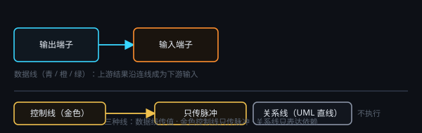

# 节点、端子与连线

## 添加节点

画布空白处右键：输入、处理、保存、对话、智能、任务、控制流、绘制等分类。控制类节点带**金色外圈**。

## 端子与连线

- 从**输出端子**（右）拖到**输入端子**（左）。不能成环。
- 输入端子默认 1 个，连上后常会自动再空出一个。
- **控制连线是金色的**，只传脉冲（定时、闸门、执行/清空），不当作数据输入。

## 继承与自动运行

输入节点一旦被连上，内容变为**只读并继承上游**；断开即可再编辑。YAML 文本会自动变成批量条目。

点 ▶ 时，若上游尚未处理，会**自动递归执行**直到就绪。

## @ 引用

在提示词中输入 `@`，只列出**已连接**节点。运行时输入进入「背景信息」，提示词进入「内容」。图像引用作为参考图。
