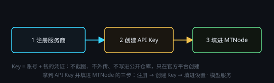

# 配置服务商与 API

> 一句话目标：拿到一串 `sk-` 开头的 API Key 并填进 MTNode——先弄清 API Key 是什么，从四大国内服务商里挑一家注册，需要国外模型 / 图片生成时再走聚合平台，最后三步拿到并填入 Key。

*图：拿到 API Key 并填进 MTNode 的三步*

## API Key 是什么（AI 的会员卡）

### 使用 AI 服务必备的 API Key 是什么，为什么要获取

API Key 可以理解为「向 AI 大模型提供商付费的会员卡」。

- 你去提供商的官网注册账号、充值购买额度后，平台会给你一串字符（一般长这样：`sk-xxxxxxxxxxxxxxxx`），这串字符就是 API Key。
- 把这一串字符填进 MTNode 的设置中（或任何调用方），就能调用该提供商的模型：你每用一次，平台按用量从你的余额里扣钱。
- 所以它本质上是「你的账号 + 你的钱」的凭证，和银行卡账号加密码一样敏感：一旦外传（发到群里、截图发人、写进公开代码仓库、上传到第三方网站），别人就能拿你的余额跑模型，也就是俗称的「被盗刷」。

### 安全守则

1. 完整 Key 不发给任何人，不截图，不贴进聊天窗口，不写进公开代码仓库。
2. 只在官方平台页面创建和复制 Key；不要买来路不明的「共享 Key / 代充 Key」。
3. 万一怀疑泄露：立刻去平台后台删掉旧 Key，再新建一个，这个过程是完全免费的。
4. 一般可以在平台里给 Key 设置用量上限或余额提醒，避免被大量消耗。

## 国内四大服务商 + 注册网址

### 国内主流大模型服务商（四选一即可）

1. DeepSeek（深度求索）
   注册网址：https://platform.deepseek.com/
2. 通义千问 Qwen（阿里云百炼）
   注册网址：https://bailian.console.aliyun.com/
3. 智谱 GLM（BigModel）
   注册网址：https://bigmodel.cn/
4. Kimi（月之暗面 Moonshot）
   注册网址：https://platform.moonshot.cn/

### 当前建议

现阶段只用 DeepSeek 就足够了：性价比极高、速度很快、中文与代码能力第一梯队、注册门槛低、对新手也最省事。其余三家可以先注册放着备用，等确实需要再充值，偶尔提供的套餐性价比也不错。

### 通用流程

注册账号（手机号 / 邮箱）→ 实名与充值（多数平台有新用户赠送额度，可先免费试）→ 进入「API Keys / 密钥管理」页面 → 新建 Key → 复制并立即保存好。

注意：Key 通常只在创建时完整显示一次，关掉页面就再也看不到了，只能重新创建。

## 国外模型 / GPT 图片生成：API易聚合平台

### 要用国外模型或 GPT 图片生成模型怎么办

国内网络直连国外大模型（尤其是 GPT 系列图片生成模型）通常不方便。这时可以用聚合平台「API易」。

注册网址：https://api.apiyi.com/

### 说明

- 推荐 API易 主要是用于生成图像；调用国外旗舰模型（例如 GPT-6 和 Fable 5）会非常贵，你也可以自行选择其他同类平台。
- 聚合平台的作用：用一个账号、一个 Key、一套 OpenAI 兼容接口，帮你转发调用多家模型，不用自己解决网络问题。
- 在 MTNode 里的用法：打开「模型服务」设置 → 新增服务商 → 按 API易 官方文档填 Base URL（接口地址，例如 https://api.apiyi.com/v1）与刚刚拿到的 API Key → 就能选到对应的国外模型 / 图片模型（例如 gpt-image-2.5-all）。

### 提醒

- 聚合平台同样是按量付费，注意余额与用量上限；Key 一样绝不能外传。
- 「图片模型」需要单独创建一个服务商，并选择类型为“图像 OpenAI兼容”。

## 三步拿到 Key 并填入 MTNode

### 配置 MTNode

第 1 步 · 注册：打开上面任意一个注册网址（例如 DeepSeek：https://platform.deepseek.com/），用手机号或邮箱注册并登录。

第 2 步 · 充值 / 领额度：可先少量充值（例如充 10 元试水）。

第 3 步 · 创建并保存 Key：进入「API Keys / API 密钥」页面 → 点「创建 / 新建」→ 复制那串 sk- 开头的字符 → 先粘贴到本地记事本或密码管理器保存好。

### 把 Key 填进 MTNode

打开应用「设置 → 模型服务」→ 选择或新增服务商（Deepseek 官方）→ 把 API Key 粘贴进 Key 输入框 → 保存。之后在节点里选择该服务商的模型就能用了。

### 最后再强调一次

这串 Key 等于你的银行卡账号 + 密码，绝不外传；一旦怀疑泄露，立刻到平台后台删除并重建。
