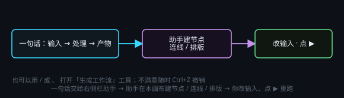

# 一句话搭工作流

> 一句话目标：用一句话让全局助手在本画布搭出可编辑、可一键重跑的内容生成管线，你只需改输入、点 ▶ 重跑。

*图：一句话交给右侧栏助手，节点、连线、排版都由它搭，你只需改输入、点 ▶*

## ③ 助手说明 · 一句话让全局助手搭工作流

### 怎么让全局助手自动搭一条工作流

1. 点击右侧栏【◆】按钮对全局助手说：为我生成一个工作流（或是输入 `/` 或 `、` 点击生成工作流的工具）。然后输入需要实现哪种工作流，例如输入是什么（一段文字 / 一张图 / 一个文稿文件 / 一段产品资料）、需要进行哪种处理等等。
2. 一句话示例：「/generate-workflow 用这段文稿生成一条带字幕的口播视频工作流：使用文稿生成口播稿然后生成语音，最后生成Remotion视频，保存为mp4」。
3. 助手会直接在本画布建节点、连线、排版；你只需改输入、点控制节点 ▶。
4. 画布上的简单单链示例工作流完全由 MTNode 自主生成；⑤ 是复杂示例——只给一段产品资料，生成：长介绍 + 社媒文案 + 2 张图 + 配音 + 15 秒短片（分镜脚本 → 画面提示词 → 竖版首帧图 → TTS 配音 → H3 短片生成），共 18 个节点 / 33 条连线 / 7 个产物文件（长文 + 双图 + 配音 + 影片），纯手工配置会较为费时。
5. 除非明文要求，全程一般只进行新增、不改动你已有的节点；不满意随时 Ctrl+Z 撤销。
6. 生成工作流没有上限限制，甚至可以用于拆解一部小说。
