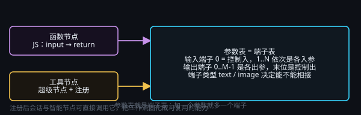

# 工具节点与函数节点

> 一句话目标：把重复的小计算与小能力固化成可复用的节点——函数节点约定 JS 的输入输出，工具节点按「参数即端子」的口径把能力注册出去。

*图：参数表就是端子表——加一个参数就多一个端子*

## 工具 / 函数节点总览

### 总览

这两个节点用于「把逻辑做成可复用的节点」：也可通过内网来调用应用以外的程序接口，例如 Python 应用或是一些物联网应用。

该节点一般通过「全局助手」委托 AI 来实现即可。

- **函数节点**：直接写 JS。输入 = 上游传来的参数，输出 = 返回的结果。
- **工具节点**：把参数（端子）定义清楚，再把这项能力注册出去，让会话按需调用它。

### 设置

参数表就是端子表：加一个参数就多一个端子。

输入端子 0 = 控制入，1..N 依次是各入参；输出端子 0..M-1 是各出参，末位是控制出。

## 函数节点 · 节点说明

### 测试中

该功能缺乏测试，请谨慎使用。

### 函数节点是什么

植入 JS（Javascript）函数，用于运行脚本和确定性运算。该函数可被工具节点调用，可以实现很多大语言模型不擅长的内容，或替代模型的一部分工作，或外部调用其他程序的接口。不建议手动写入，建议根据需要让 AI 来编写函数节点。

### 输入 / 输出约定

- **入参**：`input = { 参数名: 值 }`；图像类参数是 `{ kind: "image", path }`。
- **出参**：`return { 输出名: 值 }`，键名要和输出端子表一致。
- **端子顺序**：输入端子 0 = 控制入，1..N 依次是各参数；输出端子 0..M-1 是各出参，末位是控制出。

## 工具节点 · 节点说明

### 测试中

该功能缺乏测试，请谨慎使用。

### 工具节点是什么

工具节点 = 超级节点 + 多个函数节点及其他节点的封装节点。注册后，智能节点与会话可以直接调用它。

### 关键参数

- **名称 / 用途说明**：AI 靠说明判断什么时候用它。要写清「什么时候用 + 输入什么 + 输出什么」。
- **输入端子表 / 输出端子表**：就是它的参数与返回值；端子类型（text / image）决定能不能相接、下游怎么选型。

### 用在哪

可以通过组合各种节点，将工作流固化成工具，会话里可复用。
