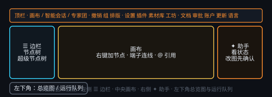

# 界面导览

## 顶栏

- **工作流编排 / 智能会话**：两种主视图。工作流是节点画布；智能会话是常驻的智能任务聊天。
- **撤销 / 重做 / 复制 / 居中 / 框选 / 组 / 超节点 / 自动排版 / 隐藏线**
  - **隐藏线**是个开关：按一下把所有连线（含关系线）压到 95% 透明，排版后只看布局；再按一下恢复。纯视觉，不改动画布数据、不进撤销栈；正在拖的新连线与「选中节点相关的连线」仍会亮起。
- **设置 · API/配置**：服务商、智能能力、主题、网格。
- **新建 / 工作流列表 / 改名 / 导出 / 创意工坊 / 导入 / 删除**
- 右上角：**文档**（本手册）、**素材库**（跨画布共享的本机内容仓库，见 [素材库与素材节点](#asset-library)）、**插件**、**审批**、语言切换（选中的语言同时是 agent 的「交流口味」：用它沟通、也期望用它回答）；有新版本时出现高光 **更新**。

## 画布区

工具条左侧 **☰** 打开边栏：上方为**当前画布**节点 / 绘图列表（点击居中）；下方为**超级节点**树（点击进入该超级节点画布）。筛选框可搜标题与子文件夹。右侧 **✦** 打开全局 AI 助手（可看画布状态；改图会确认）。

进入任务或超级节点后，工具条出现**面包屑**，可返回上层。

底部状态栏显示工作流名、节点/连线数量、服务商数、网格、缩放与保存状态。点 `@ms2308` 可打开作者主页。
