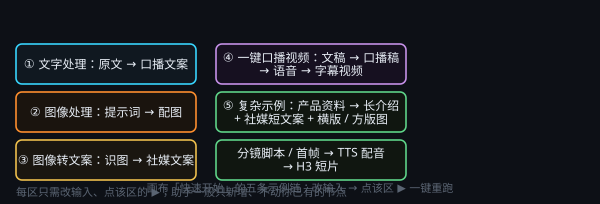

# 保存、导入导出与工坊

> 一句话目标：看懂画布「快速开始」里五条示例链各自能做什么，以及怎么用一句话让全局助手搭出可编辑、可一键重跑的内容生成管线。

*图：画布「快速开始」里的五条示例链，每条只需改输入、点该区 ▶ 一键重跑*

## 全局助手与工作流

「全局助手与工作流」分区演示用全局助手一句话自动搭出可编辑、可一键重跑的内容生成管线，内含 5 条示例：

- **① 文字处理**：一条做文字处理的简单单链示例。
- **② 图像处理**：一条做图像处理的简单单链示例。
- **③ 图像转文案**：一条把图像转成文案的简单单链示例。
- **④ 一键口播视频**：一条一键产出带字幕口播视频的简单单链示例。
- **⑤ 复杂示例**：单产品完整发布包——800 字长介绍 + 社媒短文案 + 横版主视觉 + 方版细节特写 + 15 秒短片分镜/首帧 + TTS 配音 + H3 短片，共 18 个节点 / 33 条连线 / 7 个产物文件，是手工配置代价最高的那条。

①②③④ 这四条简单单链示例完全由 MTNode 自主生成；⑤ 的「分镜脚本 → 画面提示词 → 竖版首帧图 → TTS 配音 → H3 短片生成」这一串，纯手工配置会较为费时。每区只需改输入、点 ▶ 重跑。

## ③ 助手说明 · 一句话让全局助手搭工作流

### 怎么让全局助手自动搭一条工作流

1. 点击右侧栏【◆】按钮对全局助手说：为我生成一个工作流（或是输入 `/` 或 `、` 点击生成工作流的工具）。然后输入需要实现哪种工作流，例如输入是什么（一段文字 / 一张图 / 一个文稿文件 / 一段产品资料）、需要进行哪种处理等等。
2. 一句话示例：「/generate-workflow 用这段文稿生成一条带字幕的口播视频工作流：使用文稿生成口播稿然后生成语音，最后生成Remotion视频，保存为mp4」。
3. 助手会直接在本画布建节点、连线、排版；你只需改输入、点控制节点 ▶。
4. 除非明文要求，全程一般只进行新增、不改动你已有的节点；不满意随时 Ctrl+Z 撤销。
5. 生成工作流没有上限限制，甚至可以用于拆解一部小说。
