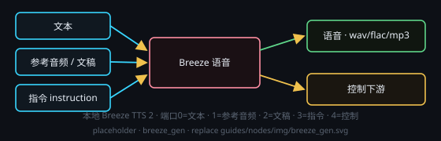

# Breeze 语音生成（Breeze TTS 2）

画布右键 → **处理节点 › 音频生成 › Breeze 语音生成**。把文本合成成**语音**：后端是插件「Breeze TTS 2 本地 TTS」在本机拉起的管理服务（默认 `127.0.0.1:8772`）+ 官方 `breeze_infer.api` 推理引擎（`127.0.0.1:8773`，**按需拉起**）。**每次运行只生成一个音频文件**（`.wav` / `.flac` / `.mp3`），写入节点自带的 `outputPath`。**输出路径也可以留空**：把它的**数据输出**接到下游的「保存」节点，路径就归那个保存节点管 —— 产物先落**应用托管目录**（应用数据目录下的画布资产 / 临时区），再由那个保存节点落盘到你填的保存路径；数据只落你选的安装目录与 `%APPDATA%\pipeline-console`。

## 端子
- **输入**：端口 0 = 待合成文本 · 端口 1 = 参考音频（音频文件 URL）· 端口 2 = 参考文稿（文字，或音频 / 视频输入节点）· 端口 3 = 指令 instruction · 端口 4 = 控制输入
- **输出**：端口 0 = 语音音频（下游可试听 / 保存）· 端口 1 = 控制输出

## 两个文本框（卡片上直接编辑）
- **输入文本（需要念的）** —— 端口 0 的待合成文本：**端口 0 有输入时这个框只读回显**，端口空着才可编辑（存节点上的 `srcText`，随节点持久化）。
- **参考文本（参考音频对应的文字）** —— 端口 2 的参考文稿：同一条规则，**端口 2 有输入时只读回显**，端口空着才可编辑（存节点上的 `refText`）；选了音色库音色而这个框留空时，合成会用音色库自带的那份参考文本。
- 这个框**只显示文字**：端口 2 接的若是音频 / 视频输入节点，显示的就是**该节点端口 1 的转写输出**（它自己转好的文字）—— 接到的是它的**音频输出口（端口 0）**时，那一路是音频本身，框里空着，绝不把那条 `file:///…` 路径当参考文字；还没转写过也是空着，卡片上会写清「去那只音频节点点转录」。端子给的是音频 / 视频文件（音频 URL、`E:\…\ref.wav` 这类本机路径，来自保存节点 / 生成节点 / 把路径当文本给的节点都算）时，这个框**一样只读且空着**，绝不把那条路径当参考文字显示 —— 那一路音频由节点当**参考音频**取走，参考文本要另外给：在框里填，或把音频节点的**转写输出**接到端口 2。
- 两个框都是**端子优先**：接上输入的那一刻框就变只读，断开又归你改。本节点**不做转录** —— 参考文本要自己填，或从端口 2 接进来（转录在音频 / 视频输入节点上做，见它们的指南）。

## 参数
点节点头部 **⚙ 设置** 打开设置窗口来改；改完即时生效，节点卡片上只显示一行当前摘要。

- **音色**：音色库 id（安装目录 `voices/<id>/{ref.wav, ref.txt}`），留空 = 用端子给的参考音频
- **能力**：自动判定 / 音色克隆 / 音色设计 / 音色导演
- **指令 instruction** / **cfg_scale**（默认 1，有 instruction 时官方建议 4）/ **seed**（默认 42）
- **输出格式**：`.wav` / `.flac` / `.mp3` · **输出路径**：保存位置（相对工作目录 / 超级节点子文件夹）；**接了保存节点就可以留空** —— 那时路径归那个保存节点管，产物先落应用托管目录、再由它落盘（见「保存」节点指南）。没接保存节点时必填，留空点 ▶ 会提示「未设置输出路径时无法启动生成」。
- **抽卡次数**：多次尝试（1–10），取其中一次结果

## 注意
- **许可**：推理代码 Apache-2.0；**模型权重、衍生模型与自托管输出受 BreezeBlue Research and Non-Commercial License 约束，仅限研究与「非商用」用途** —— Apache-2.0 不授予商用权，付费订阅只覆盖 breezeblue.ai 托管平台的输出、不覆盖自托管；禁止未授权语音克隆与冒用。
- **参考源优先级**：端子的「参考音频 / 参考文本」优先，端子为空时才用节点设置里选的音色（音色库在 **插件 › Breeze TTS 2 本地 TTS** 的控制台里维护，一条 = 安装目录 `voices/<id>/` 下的参考音频 + 文稿）；**参考音频两个口都认** —— 端口 1（音频文件 URL）与端口 2（音频 / 视频输入节点，取它自己的音频文件），两边都接了就取端口 1；**给了参考音频就必须同时给参考文本**（官方接口要求成对：在「参考文本」框里填，或把音频节点的**转写输出**接到端口 2 —— 音频节点还没转录就先去它上面点「转录」），否则节点在本地拦下并给明确指路，不白跑一趟引擎。节点状态行会写明本次实际用了哪个源。
- **三种能力（官方口径）**：有参考音频且无 instruction = **音色克隆**；有 instruction = **音色导演**；无参考音频 = **音色设计**。
- **mp3 需要 ffmpeg**：wav / flac 由 soundfile 封装，mp3 走安装目录 `tools/ffmpeg/`（安装脚本会下便携 ffmpeg）；缺失时节点给明确中文指路，建议改用 wav / flac。
- 与音乐 / 视频走同一条**串行链**（同一时刻只跑一个生成任务）**并持全局音视频互斥锁** —— 引擎 eager 就要约 7.7GB 显存，会和音乐 / 视频抢显存；SoVITS（`tts_gen`）是独立进程、**不持这把锁**。
- 需要 **NVIDIA GPU，12GB 显存起步**（eager 约 7.7GB）；Windows 原生可跑（官方 README 只写 Linux，本插件走默认 eager 路径，不启用 CUDA Graph fast 路径）。
- **后端常驻**：管理服务与引擎是常驻单例，**不随 MTNode 退出**，关掉控制台窗也不影响后端；要停服务 / 释放显存，点插件卡片主按钮「**停止**」（会连托盘一起退），或用托盘菜单「**停止服务并退出**」。卡片上那颗「**控制台**」只是显式打开控制台窗；后端状态与日志在卡片右侧详情面板的内嵌 console 里就能看（后端主动求助不再自动弹窗，改为卡片角标 + 状态行一句）。
- **后端报错会弹窗**：装坏 / 跑挂时主窗口会弹一份**错误报告**（错误码、错误正文、console 日志尾部、出问题的节点），并问你要不要「**🤖 自动修复**」——新建一条你看得见的会话，按安装技能 `breeze-tts-local-install` 的【自我修复】模式在**本插件的 INSTALL_DIR** 里修，修好后**自动重启后端**并刷新本节点状态。主动取消、正在安装中、磁盘不够、没 N 卡、驱动太旧、安装目录不合法这几类**只报告不自动修**（详见手册「插件报错弹窗与自动修复」）。
