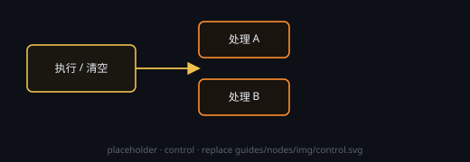

# 执行 / 清空

批控节点。把要操作的节点连到本节点（连出或连入均可），点 ▶ 一次执行或清空。

## 设置
**动作（执行 / 清空）、「补缺」与「固定节点」**在节点头部 **⚙ 设置** 打开的设置窗口里改；要改「管哪些节点」仍在画布上连线，设置窗口里只列清单。

## 端子
- **输入 / 输出**：控制（双向都算目标）

## 模式
- **执行**：对已连接节点跑 ▶
- **清空**：清掉已连接节点的结果
- **补缺**：只跑还没有输出的节点
