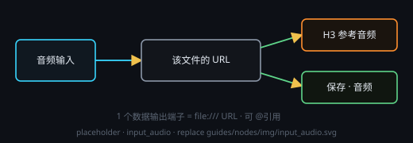

# 音频输入（选择文件 · 输出 URL）

放一段本机音频当**素材**：点「选择音频」，或直接把 mp3 / wav / ogg / flac / m4a / aac 等文件拖到节点上；也可以点「录制」用麦克风**现场录一段**。

## 端子
- **输入**：默认 1 个（端子存在、也能连线，但内容就是你在本节点选的那个文件，接上游不会产生任何效果）
- **输出**：**固定** 2 个数据端子
  - **端子 1 · 音频输出** —— 值是该文件的 `file:///…` URL（中文与空格自动百分号编码）
  - **端子 2 · 转写输出** —— 值是本节点「转录」出来的文字（本机 SenseVoice，见下）；**还没转 / 没转出内容时给空文本**（不是断线、也不是那个 URL）

## 现场录制
- 点操作行上的「录制」→ 弹出居中**录音面板**：实时声波 + 计时；节点上同时显示「● 录制中 00:12」
- 麦克风用**系统默认输入设备**；面板出口只有两个：**停止并保存**、**取消**（丢弃，会再问一次；`Esc` 等同取消）
- 录完自动编码成**真 mp3**（128 kbps · 44.1 kHz · 单声道，与 ffmpeg 无关 —— 编码器随包自带），
  以 `record_{yyyymmddhhmmss}.mp3` 落在**画布工作目录**（顶栏那格）下的 `recordings/` 子目录里
  —— 时间取**按下录制那一刻**，同一秒里再录一段会自动追加 `_2`、`_3`…，不会覆盖已有的录音
- 录完面板自动关闭，这张节点**就地绑定**新文件并立刻显示波形可试听；原文件只是不再被引用，磁盘上不删
- 录制替换掉原文件后，节点上**旧的转录文本会被清空**（那是上一份录音的文字），要文字就再点一次「转录」
- 没有设置工作目录时，点录制会先提示去顶栏设置（不静默换个地方落盘）

## 怎么用
- 连 **端子 1（音频输出）** 进 **Minimax H3** 的参考音频端子：接收端会把 URL 归一回本机绝对路径再交给后端，你不用手动转
- 连 **端子 1** 进 **保存** 节点：按音频落盘（复制到你指定的路径）
- 连 **端子 2（转写输出）** 进文字 / 智能 / 保存等文本端子：拿到的是这段音频的**文字**（先在本节点点「转录」，或等下游运行时自动转）
- `@` 引用：注入到提示词里的那段文本就是这个 URL（有转录时改用转录文字，见下）

## 说明
- 节点里的预览是**方角波形预览器**：显示这段音频的大致波形，**点（或按住拖动）波形任意位置**就从该处开始试听；左侧方块按钮播放 / 暂停。本机解不开的编码（或超大的音频）退化为进度条，点定位试听照旧可用
- 只记录文件的**原始绝对路径**（不复制进工作流资产，音频可能很大）；文件被移走后要重新选一次
- 拖错类型（比如视频）会提示，不会改节点内容
- 要**生成**音频：语音用「音频生成 › SoVITS 语音」，音乐用「音频生成 › Minimax Music 3」
