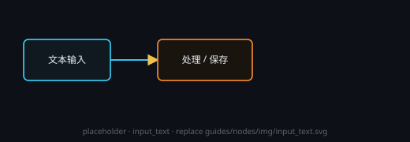

# 文本输入

在节点内直接编辑文本，或开启批量后添加多条。输出沿数据端子传到处理 / 保存节点。

## 端子
- **输入**：一般无（可被上游覆盖为只读继承）
- **输出**：文本

## 常用
- 批量：多条文本，下游可「逐条」或「聚合」
- 拖入 / 导入 YAML 可快速填条目

## Markdown 编辑器（节点头部 ✎）

节点头部右上那排小按钮里有一枚 **✎**（与 📄 文件参考并排）：点它打开**近乎全屏的写作窗**，
像 WPS 一样写正文。节点板身上那个输入框照旧留着 —— 改一两个字的活儿不必开大窗。

- **只给能改的文本节点**：内容来自上游连线（只读继承）、或由「拆」节点生成的只读文本节点，
  不给这枚按钮（它们的正文不由你写）。
- **所见即所得 + 源码两档**：正文直接渲染成排版好的样子（标题、列表、表格、公式都在），
  点顶部「源码」可切到 Markdown 原文；粘贴一律按纯文本落进来，不会把外部 HTML 悄悄塞进正文。
- **方形图标工具栏**：一级 / 二级 / 三级标题、正文段落、加粗、斜体、删除线、引用、无序 /
  有序列表、任务清单、水平线、链接、行内代码、代码块、插图、表格、行内 / 显示公式，以及撤销重做。
  表格与公式走小对话框录入，插图见下一节。
- **窗口**：右下角可拖调大小（最小宽 ≥ 屏幕一半），右上角 **⤢ / ⤡** 一键放大到全屏 / 还原。
  点窗外不会关（改到一半不会被点没了）；✕、Esc 或「保存」收工。
- **保存**：**保存**（或 Ctrl+S）把当前版写回节点正文，画布随之刷新，下游中间结果清掉 ——
  下游重跑就会拿到你改后的正文。还有未保存改动时关窗会先问一次，绝不静默丢弃。

### 配图怎么存

在编辑器里插图有三种入口：工具栏的 **🖼**（选本机图片 / 从剪贴板粘贴截图）、直接把图片文件**拖进正文**、
或复制图片后 **Ctrl+V**。图片会**复制进画布工作目录下的 `assets/`**，正文里以 `assets/<文件名>` 相对路径引用 ——
工作目录换机器、整个搬走都不会丢图。

画布还没设工作目录时，插图会先弹出「请填写工作目录」窗：选一个文件夹后再插一次即可
（不落本机绝对路径，避免正文换台机器就找不到图）。

### 批注 + 让 AI 依据批注修订

写作之外，这个窗还是**修订工作台**（与文本处理节点的「✎ AI 审阅」是同一套机制、同一份记录）：

- **全文批注**：工具栏或右侧栏的「+ 全文批注」，对整篇提意见。
- **局部批注**：点工具栏「局部批注」开启后，在正文里**拖选一段文字**，右侧会浮出一张便笺，
  写完点「绑定批注」就绑在那段上（可加多条；正文改动后锚点会自动就近重跟，跟丢了会标「可能失效」）。
- **让 AI 依据批注修订**：出现第一条批注后，顶部出现醒目的「✨ 让 AI 依据批注修订（N）」。
  点它把**当前版全文 + 历史全部批注**交给该节点自身选定的服务商与模型，产出**新的一版**，
  批注清空进入下一轮（历史批注仍累计参与后续修订）。上方的服务商 / 模型口径与「✎ AI 审阅」一致：
  节点没选服务商时回退到任一可用文本服务商。
- **每一版都完整留着**：窗口顶部那排版本页签按 1、2、3… 排列，末版标「最新」（只有最新版可改）。
  点旧版可**回看**（连同该版绑定过的批注）；要回到某一版就点页签旁的 **↩ 回滚到此版** ——
  该版重新成为当前可编辑版，其后各版**作废但仍可回看**（不会删掉你的历史）。
- **记录随节点走**：批注与版本链存在节点上（`node.review`），与画布一起保存；
  和「✎ AI 审阅」共用同一份 —— 两边看到的历史与批注永远是一份，不会各记各的。
- 同一个节点上，**Markdown 编辑器与「✎ AI 审阅」同时只能开一个**：一个正开着时，另一个入口会提醒你先关掉它。
