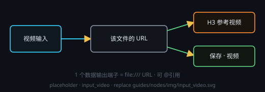

# 视频输入（选择文件 · 输出 URL）

放一段本机视频当**素材**：点「选择视频」，或直接把 mp4 / webm / mov / mkv / avi 等文件拖到节点上。

## 端子
- **输入**：默认 1 个（端子存在、也能连线，但内容就是你在本节点选的那个文件，接上游不会产生任何效果）
- **输出**：**固定** 2 个数据端子
  - **端子 1 · 视频输出** —— 值是该文件的 `file:///…` URL（中文与空格自动百分号编码）
  - **端子 2 · 转写输出** —— 值是本节点「转录」出来的文字（视频按音轨转，本机 SenseVoice）；**还没转 / 没转出内容时给空文本**

## 怎么用
- 连 **端子 1（视频输出）** 进 **Minimax H3** 的参考视频端子：接收端会把 URL 归一回本机绝对路径再交给后端
- 连 **端子 1** 进 **保存** 节点：按视频落盘（复制到你指定的路径）
- 连 **端子 2（转写输出）** 进文字 / 智能 / 保存等文本端子：拿到的是这段视频音轨的文字（先在本节点点「转录」，或等下游运行时自动转）
- `@` 引用：注入到提示词里的那段文本就是这个 URL（有转录时改用转录文字）

## 说明
- 只记录文件的**原始绝对路径**（不复制进工作流资产，视频可能很大）；文件被移走后要重新选一次
- 预览走系统播放器内核，编码不支持时只显示提示文字
- 要**生成**视频：实拍感用「视频生成 › Minimax H3」，动效用「视频生成 › Remotion 视频」
