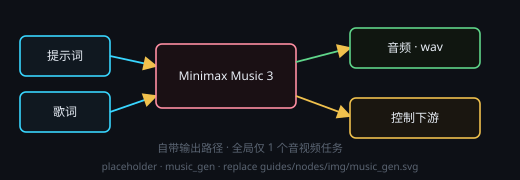

# Minimax Music 3（音乐生成）

画布右键 → **处理节点 › 音频生成 › Minimax Music 3**。本地 MiniMax Music 3 后端（Gradio）。**每次运行只生成一个音频文件**（`.wav`），写入节点自带的 `outputPath`，不需要再挂保存节点。

## 端子
- **输入**：端口 0 = 提示词 · 端口 1 = 歌词 · 端口 2 = 控制输入
- **输出**：端口 0 = 音频（下游可试听 / 保存）· 端口 1 = 控制输出

## 参数
- **输出路径**：`.wav` 保存位置（相对工作目录 / 超级节点子文件夹）
- **抽卡次数**：多次尝试（1–10），取其中一次结果
- **种子**：固定种子可复现；每次抽卡种子 +1

## 注意
- 全局同一时刻只允许 **1 个音视频任务**（音乐 / 视频互斥），其它任务会排队等待。
- 每个后端实例全局只有一个，多个音乐节点共享同一后端。
- 歌词与风格提示词的写法见技能 `minimax-music-lyrics` / `minimax-music-prompt`。
