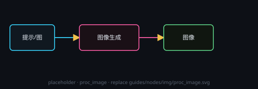

# 图像生成

按提示词生成图像。可接文本或图像输入；支持尺寸、透明背景等。

## 设置
**服务商 / 模型 / 尺寸**在节点头部 **⚙ 设置** 打开的设置窗口里改，改完即时生效；节点卡片上只显示一行当前摘要（服务商 / 模型 / 尺寸）。头部 **◈** 是预览（看运行时真正发出去的请求），与设置窗口分开放。提示词属于内容，仍写在节点里。

## 透明背景（双通道差分抠图）
标题栏的**透明开关**（灰白格小方块）默认关闭。

- **单击**开 / 关；开启后按钮不再显示图标，改为一圈**旋转的彩虹边缘**动效。
- 开启后每次生成实际会出 **2 张图**（白底 + 黑底），Token 与耗时约 **2 倍**，请慎用。
- 算法（对用户完全无感知，提示词照常写即可）：
  1. 第 1 通道：程序在提示词末尾自动注入「背景必须是均匀纯白 #FFFFFF」并生成；
  2. 第 2 通道：自动剥掉白底注入段、换上「背景必须是均匀纯黑 #000000」再发一次请求；OpenAI 兼容生图会把第 1 张作为**参考图**一起下发，要求除背景外逐像素一致，以保证两张图**完全对齐**；
  3. 两图按 `α = (255 − 白 + 黑) / 255` 逐像素解出 Alpha，再做前景包围盒对齐、边缘微调与非预乘还原，输出带透明通道的 PNG。
- 与色键抠图不同：**白色或黑色的主体不会被误抠掉**，半透明边缘（发丝、运动模糊、玻璃）也能保留真实 Alpha。
- **右键**该开关打开参数面板：噪点地板（压掉生图噪声）、边缘羽化（只平滑透明度）、自动对齐修正，以及「用已存的两通道重算抠图」（改参数后不必再花一次 Token）。
- 第 2 通道失败时不会中断流程：交付白底原图并提示原因。
- 预览区在开启后自动垫上灰白格，便于检查透明边缘。

## 端子
- **输入**：文本或图像
- **输出**：图像
