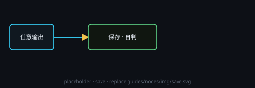

# 保存

按输入内容自判落盘类型（旧版「保存文本 / 保存图像」打开后会升级为本节点）：

- **文本** → `.yaml`
- **图像** → `.png`
- **音频**（音乐生成）→ `.wav`
- **视频**（视频生成）→ `.mp4`

路径相对工作目录或绝对路径。可开自动保存。不同媒体用不同预览（文本 / 缩略图 / 音频播放器 / 视频播放器）。

放置**音乐生成**或**视频生成**时，会在其右侧自动绑定一个保存节点：相对位置固定、连线不可删除。生成节点会把文件名写入该保存节点。

## 端子
- **输入**：文本 / 图像 / 音频 / 视频（按来源自判）
- **输出**：无（落盘）
