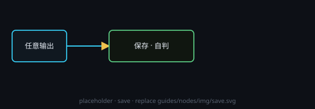

# 保存

按输入内容自判落盘类型（旧版「保存文本 / 保存图像」打开后会升级为本节点）：

- **文本** → `.md`（批量 / 聚合条目仍按 `.yaml`）
- **图像** → `.png`
- **音频**（音乐生成）→ `.wav`
- **视频**（视频生成）→ `.mp4`

路径相对工作目录或绝对路径。节点若在**超级节点**内且该超节点设了子文件夹，相对路径会自动落在该子文件夹下（见 [超级节点](#super-nodes)）。可开自动保存。不同媒体用不同预览（文本 / 缩略图 / 音频播放器 / 视频播放器）。

放置**音乐生成**或**视频生成**时，会在其右侧自动绑定一个保存节点：相对位置固定、连线不可删除。生成节点会把文件名写入该保存节点。

## 上游生成节点的输出路径可以留空
「音乐生成 / 语音生成 / 视频生成 / 视频超分 / 视频补帧」这些节点自带输出路径，但**不必填**：把它们的**数据输出**接到本节点，路径就归本节点管 —— 上游产物先落**应用托管目录**（应用数据目录下的画布资产 / 临时区），本节点再按自己的**保存路径**落盘。此时上游节点卡片上的路径显示为托管态，产物命名与去重也归宿主决定：运行完的状态行会多一句「托管目录 · 由保存节点落盘」。

- **本节点的保存路径仍要填**：它就是最终落点，留空时点 ▶ 只会提示「请先指定保存路径（可用「浏览」选择）」。
- 上游**没接保存节点**时仍是老口径：必须自己填输出路径，否则点 ▶ 报「未设置输出路径时无法启动生成」。
- 旧画布上那对自动绑定的「生成 ↔ 保存」照旧把路径迁移回生成节点；**用户手连的线一律不动**（它就是托管口径的载体）。

## 设置
**文件名**直接在节点卡片上改：卡片上有一行「文件名」输入框，旁边一枚只读小片显示当前会补的后缀（`.md` / `.png` / `.wav` / `.mp4`）。文件名**默认不带后缀**，只有输入内容类型定下来（连上输入、或你自己在名字里写了可辨认的后缀）才决定后缀；还没定就显示「后缀待定」，落盘前不猜。改文件名不动目录，只换最后那一段；回车 / 失焦提交，Esc 撤销。

**保存目录与自动保存**仍在节点头部 **⚙ 设置** 打开的设置窗口里改（那里也能填完整路径），改完即时生效；节点卡片上另有一行当前摘要（实际落盘路径 + 自动保存开 / 关）。「浏览 / 位置 / 打开」是动作按钮，仍留在节点上。

## 图像输出（按图像保存时才出现）
保存图像时默认**原样复制**（后缀跟保存路径，通常 `.png`）。要在存盘这一步顺手改图，点节点头部的**图像输出**按钮（或 ⚙ 设置窗里的「图像输出设定…」）打开面板：

- **尺寸**：原样 / 按比例缩放（等比例采样放大缩小，长宽比不变）/ 自定义像素宽高（可只填一侧）
- **裁剪**：不裁 / 从中间裁（按目标长宽比取源图中央最大的一块）/ 自定义矩形（按源图像素填 x / y / 宽 / 高，越界自动夹回图内）
- **格式**：`.png`（无损，保留透明）/ `.jpg` / `.jpeg` / `.webp`（有损，体积小）/ `.bmp`；选了格式后保存路径的后缀会跟着换
- **质量**：0.1–1.0，只在有损格式（JPG / WebP）生效；透明区在这类格式里自动填白

面板里的「预览效果」按当前设定真算一张给你看（尺寸 / 格式 / 质量 / 裁剪自源图多大都写在下面），「恢复默认」＝回到「原样 + PNG」。批量 / 多图保存时每个文件套同一套设定；聚合模式仍只写第一条中的第一张图。

## 端子
- **输入**：文本 / 图像 / 音频 / 视频（按来源自判）
- **输出**：1 个 = **本次保存的内容**（保存什么就给下游什么，颜色与语义都是数据端子）：
  - 文本保存（含批量 / 聚合 `.yaml`）→ 最后写盘的那份正文
  - 图像 / 音频 / 视频保存 → 最后落盘的那个文件
  - PDF 生成 → 落盘的 PDF 地址
  - 还没保存过 → 先给上游输入的内容，不必先点一次 ▶ 才连得上

  因此保存节点可以继续往下接（文本处理 / 再保存一份 / 合并 / 智能节点），也可以被 `@引用`（文本类保存）。保存 → 保存 不会自动级联落盘：下游那个保存节点仍需自己点 ▶。
