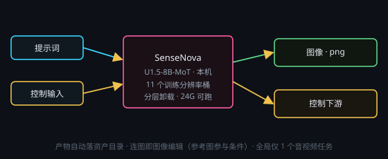

# SenseNova 图像生成（本机文生图 / 图像编辑）

画布右键 → **处理节点 › 图像生成 › SenseNova**。本机 SenseNova-U1.5-8B-MoT 后端（插件「SenseNova 本地图像生成」，对照开源项目 [OpenSenseNova/SenseNova-U1](https://github.com/OpenSenseNova/SenseNova-U1) 移植）。**每次运行只出一张图**（`.png`），生成结果自动进入应用资产目录并从节点输出端子（端口 0，图像）交出去，下游直接接 `save_image` / 预览，无需填任何路径。旧画布残留的 `outputPath` 会被忽略。

与云端「文生图（云端服务商）」节点（`proc_image`）的区别只有三点：**跑在本机**（离线、不上传提示词、不按张计费）、**分辨率只能取官方 11 个训练桶**（不是任意宽高）、**要有一张 N 卡**。端子语义与输出形态（`{kind:"image", path}`）和 `proc_image` 完全一致，所以下游的图像预览 / `save_image` / `@` 引用一条都不用换。

## 端子
- **输入**：端口 0 = 提示词文本 · 端口 1+ = 增量数据槽（文本 / **图像参考**）· 控制输入
- **输出**：端口 0 = 图像（下游可预览 / 保存）· 端口 1 = 控制输出

端口 0 未接线时直接读节点上填写的提示词。**连了图像（数据槽接图像节点，或用 `@` 引用 / 全局广播取到图）就自动进「图像编辑」模式**：这些图作为参考图随请求下发给本机后端，走 `it2i_generate` 参与条件生成（换风格、改局部、照着参考图构图都行）。读不到的参考图会在节点状态与警告里逐条说明，不会静默丢弃；一张都取不到就退回纯文生图。

## 参数
点节点头部 **⚙ 设置** 打开设置窗口来改；改完即时生效，节点卡片上只显示一行当前摘要。

- **分辨率桶（官方训练尺寸）**：官方只有 **11 个训练桶**，`1:1` = 2048×2048、`16:9` = 2720×1536、`3:2` = 2496×1664、`4:3` = 2368×1760、`2:3` = 1664×2496、`3:4` = 1760×2368、`1:2` = 1440×2880、`2:1` = 2880×1440、`1:3` = 1152×3456、`3:1` = 3456×1152（最高原生 4K）；选桶即定宽高，不提供任意宽高
- **采样步数**：`1–200`，节点默认 30（官方默认 50）；**省时间 / 省显存主要靠它**，试机可降到 20 以内
- **CFG Scale**：提示词贴合度，官方默认 4.0；越大越贴提示词、越容易过饱和
- **CFG Norm**：`none`（默认）/ `global` / `channel` / `cfg_zero_star`
- **Timestep Shift**：噪声调度平移，官方默认 3.0
- **参考图条件强度**：连了参考图（图像编辑模式）才生效，对应后端的 `img_cfg_scale`；`1.0` = 关闭图像 CFG（官方默认），调到 `1.5–2.0` 会更贴参考图；没有参考图时该值不下发
- **抽卡次数**：多次尝试（1–10），每次只出一张，输出命名 `#1`、`#2` …
- **种子**：固定种子可复现；**摇数**开启时每次抽卡种子 +1
- **显存档位**：`fast`（默认，官方 24G 卡档）/ `balanced` / `low` / `full`（需 48G+）；显存不足时后端会**自动降一档重试一次**并把结果写在节点状态行上
- **权重精度**：`bfloat16`（默认）/ `float16` / `float32`
- **think 模式**：开启后模型先写一段规划文本再出图，规划文本落到图旁边的 `.think.txt`

## 注意
- **装不上就出不了图**：没装插件时节点显示「插件未安装」警示条，▶ 直接中止并给安装入口，不做静默降级。安装入口在 **插件 › SenseNova 本地图像生成**（控制台可安装 / 启停 / 试生成 / 看日志；分辨率下拉与默认值全部取后端 `/health`，不抄第二份）。
- **硬件**：需要 NVIDIA 显卡，**24G 显存是官方档**（权重 bf16 约 **32.66GB**，靠分层卸载跑进一张 24G 卡）；20G 起勉强可跑、<20G 拦死。内存建议 **≥40GB**（32GB 是硬门槛，卸载出去的权重放在内存里），磁盘**建议预留 ≥60GB**。
- 全局同一时刻只允许 **1 个音视频任务**（音乐 / 语音 / 视频 / 图像生成互斥），其它任务排队等待；24G 卡上这与 H3 / Music3 抢显存是同一件事，**别并行**。
- **首次生成特别慢属正常**：权重懒加载 + 分层卸载，加载约 30 秒（本机实测 28–32 秒）；**冷启动第一张明显更慢**（首进卸载上下文 / pinned cache / cudnn 预热），期间进度会停在「采样 15%」一阵，**看「采样 N/M 步」有没有在涨**，别只盯百分比、更别点强杀。
- **参考耗时 / 显存**（4090 · bf16 · `sdpa`）：2048×2048 / 4 步 / `fast` = 首张约 63 秒 → 第二张约 24 秒，峰值 **15.9GiB**；2048×2048 / 12 步 + think ≈ 6.5 分钟，峰值 16.0GiB；`low` 档峰值仅约 **3GiB** 但慢约 2.4 倍。**第二张起变快是正常的**（模型常驻，不必重启后端）。
- **降分辨率省不了显存**：最小桶也有 2048×2048（≈400 万像素），要省只能降采样步数或降显存档位。
- Windows 上没有 `flash-attn` 轮子，注意力默认走 `sdpa`；报 `USE_FLASH_ATTENTION` 是把注意力档位设错了，**不要为此去装 flash-attn**。
- **后端报错会弹窗**：装坏 / 跑挂时主窗口会弹一份**错误报告**（错误码、错误正文、console 日志尾部、出问题的节点），并问你要不要「**🤖 自动修复**」——新建一条你看得见的会话，按安装技能 `sensenova-local-install` 的【自我修复】模式在**本插件的 INSTALL_DIR** 里修，修好后**自动重启 SenseNova 后端**并刷新本节点状态。主动取消、正在安装中、磁盘不够、没 N 卡、驱动太旧、安装目录不合法这几类**只报告不自动修**（详见手册「插件报错弹窗与自动修复」）。
- 想看后端细节（端口 / 接口 / 错误码 / 环境变量）见 `docs/sensenova-local-backend.md`。
