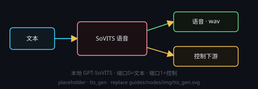

# SoVITS 语音生成（GPT-SoVITS）

画布右键 → **处理节点 › 音频生成 › SoVITS 语音生成**。把文本合成成**语音**：后端是插件「GPT-SoVITS 语音合成」在本机拉起的 OpenAI 兼容服务。**每次运行只生成一个音频文件**（`.wav` / `.mp3`），写入节点自带的 `outputPath`，不需要再挂保存节点。

## 端子
- **输入**：端口 0 = 待合成文本 · 端口 1 = 控制输入
- **输出**：端口 0 = 语音音频（下游可试听 / 保存）· 端口 1 = 控制输出

## 参数
点节点头部 **⚙ 设置** 打开设置窗口来改；改完即时生效，节点卡片上只显示一行当前摘要。

- **输出路径**：音频保存位置（相对工作目录 / 超级节点子文件夹）
- **音色**：GPT-SoVITS 音色库里的音色名，留空则交给后端默认音色
- **语速**：0.5 – 2.0（默认 1.0）
- **输出格式**：`.wav` / `.mp3`
- **抽卡次数**：多次尝试（1–10），取其中一次结果

## 注意
- 后端没装 / 没起时节点会先尝试拉起并等待在线（最长 3 分钟），失败会把可照着做的提示写在节点状态行上；安装与音色准备都在 **插件 › GPT-SoVITS 语音合成** 里完成。
- **后端报错会弹窗**：语音后端也要在本机装环境，装坏 / 跑挂时主窗口会弹一份**错误报告**（错误码、错误正文、console 日志尾部、出问题的节点），并问你要不要「**🤖 自动修复**」——新建一条你看得见的会话，按安装技能 `tts-local-install` 的【自我修复】模式在**本插件的 INSTALL_DIR** 里修，修好后**自动重启语音后端**并刷新本节点状态。主动取消、正在安装中、磁盘不够、驱动太旧、安装目录不合法这几类**只报告不自动修**（详见手册「插件报错弹窗与自动修复」）。
- 与音乐 / 视频走同一条**串行链**（同一时刻只跑一个生成任务），但 SoVITS 是独立进程、**不占主进程的音视频全局锁**，显存另算。
- 只要一段文本就能出声：文本可以来自文本输入 / 文本处理节点，也可以 `@` 引用。
