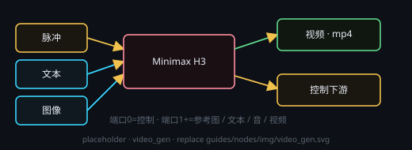

# Minimax H3（视频生成）

画布右键 → **处理节点 › 视频生成 › Minimax H3**。本地 MiniMax H3 后端（ComfyUI）。**每次运行只生成一个视频文件**（`.mp4`），写入节点自带的 `outputPath`，不需要再挂保存节点。

## 端子
- **输入**：端口 0 = 控制输入（固定）· 端口 1+ = 数据槽（参考图 / 文本 / 参考音频 / 参考视频）
- **输出**：端口 0 = 视频（下游可试看）· 端口 1 = 控制输出

## 参数
点节点头部 **⚙ 设置** 打开设置窗口来改；改完即时生效，节点卡片上只显示一行当前摘要。

- **输出路径**：`.mp4` 保存位置（相对工作目录 / 超级节点子文件夹）
- **生成模式**：`fl2va` = 首末帧（默认）；`r2v` = 多参考图
- **时长**：4–15 秒（默认 5）
- **分辨率**：auto（按比例默认）/ 480p / 720p / 1080p（显存不足自动降档）
- **后处理**：4K 超分 + 补帧（默认开；24G 显存建议关以提速）
- **抽卡次数**：多次尝试（1–10）

## 自建 ComfyUI 工作流（可选）

节点默认走内置 H3 链（首末帧 / 多参考）。想跑**自己搭的 ComfyUI 图**：点节点头部 **⚙ 设置** 打开设置窗口 → 「工作流来源」选 **自建 ComfyUI 工作流**。

- **库**：工作流存在本机全局库（`<数据目录>/h3-workflows/`），在 **H3 管理窗口 · 自建工作流库** 里导入（拖 JSON 文件 / 粘贴 JSON），ComfyUI 的 **API 格式**与 **UI 格式**都能识别（UI 格式自动转 API 格式，自动丢掉 Reroute / Note / 常量原语等前端节点）。「管理」按钮直接打开那个窗口。
- **端子**：图里被「提升为节点参数」的字段会在设置窗口里各占一个参数——**端口 1 = 文本 · 端口 2+ = 素材（图 / 视频 / 音频）**，顺序就是参数表顺序，可用 ▲▼ 调整。默认参数表取扫描建议（提示词 / LoadImage / 种子…），可增删改名。
- **直填值**：每个参数都可在设置窗口里直接填值；**端子接了数据时端子优先**，端子没接才用直填值，都没有就沿用工作流 JSON 里的原值。素材填本机绝对路径，生成时自动上传到 ComfyUI。
- **输出节点**：图里有多个 `Save*` 时指定取哪一个当本节点的产物；留空 = 最后一个视频产物。
- **失效与校验**：↻ 会把参数表与库里最新的图重新同步（图上改掉的落点标「落点已失效」，不静默删）；「校验节点包」按后端 `/object_info` 比对自定义节点是否装了（后端没运行则跳过，**不阻断生成**）。
- 种子沿用节点上的 **种子 / 摇数**：一次执行把该种子统一下发到图里**所有** `seed` / `noise_seed` 类字段。
- 自建模式下 **时长 / 分辨率 / 采样 / 4K 超分补帧等内置参数一律失效**（由工作流图自己决定，设置窗口里也不再出现这些项），也不做 24G 钳制；抽卡、进度、取消、输出路径与全局互斥照常。

## 注意
- 全局同一时刻只允许 **1 个音视频任务**（音乐 / 视频互斥）。
- 24G 显存上限会限制分辨率与后处理档位。
- 参考图 / 参考音频 / 参考视频都可以直接连**图像输入**、**音频输入**、**视频输入**节点：媒体端子给的是 `file:///…` URL，本节点会自动归一回本机路径。
