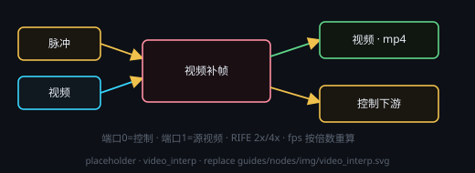

# 视频补帧（RIFE · 独立后处理）

画布右键 → **处理节点 › 视频生成 › 视频补帧**。给一段**已有视频**单独补帧：RIFE 按倍数插帧，帧率按倍数重算（2x / 4x）。它**不再跟着 Minimax H3 生成一起跑**——H3 只出原生片，补帧按需单独运行。**每次运行只出一个视频文件**（`.mp4`），写入节点自带的 `outputPath`，不需要再挂保存节点。

## 端子
- **输入**：端口 0 = 控制输入（固定）· 端口 1 = 源视频 · 端口 2+ = 可选素材（渐进展开）
- **输出**：端口 0 = 视频（下游可试看）· 端口 1 = 控制输出

源视频可以来自 **Minimax H3** 的输出、**视频输入**节点，或任何产出视频的上游；本节点只接受视频，接图像会拒绝。

## 参数
点节点头部 **⚙ 设置** 打开设置窗口来改；改完即时生效，节点卡片上只显示一行当前摘要。

- **补帧倍率**：`2x`（推荐）/ `4x` / `1x`（仅重编码）；fps 按倍数重算（源 24fps → 2x 得 48fps）。逐帧流式下倍率不再受内存限制，只影响输出帧数与耗时
- **清缓存间隔（帧）**：每 N 帧清一次缓存（默认 2）；流式档每帧算完即写盘，此项只影响回退到 ComfyUI 图链时的表现
- **逐帧批量 batch_size**：每次交给 RIFE 的帧数（默认 1）；流式档逐帧处理，此项只影响回退到 ComfyUI 图链时的表现
- **缩放系数 scale_factor**：RIFE 内部缩放系数（默认 1.0 = 原分辨率）；流式档同样生效，不改变输出分辨率
- **低显存安全档**：默认开；开 = 低精度 fp16 + 逐帧 + 极小缓存清理间隔，峰值最低
- **抽卡次数**：多次处理（1–10），多次时输出命名为 `#1`、`#2` …
- **输出路径**：`.mp4` 保存位置（相对工作目录 / 超级节点子文件夹）

## 内存 / 显存使用建议
- **默认走逐帧流式链**（`h3-pack/post/stream_interp.py`）：源视频用 PyAV 顺序解码，同一时刻只持有**相邻两帧 + 一张中间帧**，
  **每帧算完立刻编码写盘**，常驻内存只跟「相邻两帧 + 模型」有关 —— **与视频时长、分辨率、倍率都无关**，
  所以 **16G 内存也能完成 15 秒级视频的 2x / 4x 补帧**。（旧版把整段视频的帧解出来再全片收集补帧结果，
  15 秒 1080p 30fps 一份帧数组约 11GB、4x 后约 45GB，连 64G 都不够 —— 这条链已改为默认不走。）
- **显存只跟精度与缩放系数有关**：默认 fp16；显存偏小或没开安全档时后端会落 fp32。倍率越大越慢，但不影响能不能跑。
- **音轨原样直拷**：输出容器从源文件直接复制音频包，不重编码。
- 首次 OOM 时后端会**自动降一档重试一次**（精度落 fp32，必要时预缩放长边降一档，倍率不动），结果写在节点状态行上。
- **兜底链才会回到旧口径**：脚本 / venv / RIFE 权重缺失或流式链非 OOM 失败时，后端自动回退 ComfyUI 图链（控制台写明
  「已回退图路径 + 原因」，日志与旧版一致）：那时整段帧数组攒在 RAM，长边越大越吃内存，可能压长边 / 预缩放源帧。
- **跑多单不会「越跑越紧」**：流式链每次运行都是独立子进程，进程结束即回收，没有常驻内存累积；只有兜底图链仍走常驻
  ComfyUI 后端（内存护栏按单收尾量系统内存，超限才后台重启回收，见 H3 控制台「24G 启动优化」）。

## 注意
- **音轨原样带走**：源视频的音轨会一起进产物，补帧只改画面帧率。
- 全局同一时刻只允许 **1 个音视频任务**（音乐 / 语音 / 视频 / 超分 / 补帧互斥），其它任务排队等待。
- 超分与补帧是两个**互相独立**的节点，可单独用，也可串联：**H3 → 视频超分 → 视频补帧**。
- 后端没起时节点会先尝试拉起 H3 后端并等待在线，失败会把可照着做的提示写在节点状态行上。
