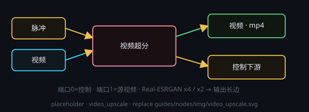

# 视频超分（Real-ESRGAN x4 / x2 · 独立后处理）

画布右键 → **处理节点 › 视频生成 › 视频超分**。给一段**已有视频**单独做超分：Real-ESRGAN 逐帧放大，再缩放到输出长边。它**不再跟着 Minimax H3 生成一起跑**——H3 只出原生片，超分按需单独运行。**每次运行只出一个视频文件**（`.mp4`），写入节点自带的 `outputPath`，不需要再挂保存节点。

## 端子
- **输入**：端口 0 = 控制输入（固定）· 端口 1 = 源视频 · 端口 2+ = 可选素材（渐进展开）
- **输出**：端口 0 = 视频（下游可试看）· 端口 1 = 控制输出

源视频可以来自 **Minimax H3** 的输出、**视频输入**节点，或任何产出视频的上游；本节点只接受视频，接图像会拒绝。

## 参数
点节点头部 **⚙ 设置** 打开设置窗口来改；改完即时生效，节点卡片上只显示一行当前摘要。

- **超分倍率**：**x4**（默认，画质最好）或 **x2**（输出只放大 2 倍，更快）。倍率是输出上限：**输出 = min(目标长边, 源长边 × 倍率)** —— x2 时 720p 源出 2560、1080p 源出 3840，不会被目标长边拉成 4 倍。
- **超分模型**：`RealESRGAN_x4plus.pth`（通用 x4）或 `RealESRGAN_x2plus.pth`（原生 x2，可选权重）——下发给超分的值必须是**文件名（含扩展名）**，缺扩展名会被判 `value_not_in_list` 拒图（应用已自动补齐）。选 **x2 倍率**时若本机有 x2 权重会**自动优先用它**（显存与耗时都低一档）；没有也能跑：用 x4 权重超分后缩到 2 倍。
- **目标长边（像素）**：1280–7680（默认 3840 = 4K），是**输出长边的上限**；逐帧分块流式下**不再受内存限制**，只是输出尺寸与耗时的选择。x2 倍率时还会被「源长边 × 2」封顶，源分辨率未知时不追加缩放（保留权重原生尺寸）
- **逐帧批量 per_batch**：每次交给超分模型的帧数（默认 1）；**低显存安全档保持 1**（流式链本来就是逐帧，此项只影响回退到 ComfyUI 图链时的批大小）
- **分块 tile（像素）**：0–1024（默认 512）。流式超分的**分块大小**：显存只跟它有关，**512 适合 16G 机器**；0 = 后端默认 512
- **低显存安全档（强制逐帧）**：默认开；开 = **分块 fp16 省显存，16G 机器也能跑 15 秒片**，关 = 按上面的 `per_batch` 批量 / 更大分块（更快但更吃显存）
- **抽卡次数**：多次处理（1–10），多次时输出命名为 `#1`、`#2` …
- **输出路径**：`.mp4` 保存位置（相对工作目录 / 超级节点子文件夹）

## 内存 / 显存使用建议
- **默认走逐帧分块流式链**（`h3-pack/post/stream_upscale.py`）：源视频用 PyAV 顺序解码，按 `tile` 分块过 Real-ESRGAN，
  **每帧处理完立刻编码写盘**，常驻内存只跟「一个分块 + 一帧输出画布」有关 —— **与视频时长、分辨率、倍率都无关**，
  所以 **16G 内存也能完成 15 秒级视频的 x2 / x4 超分**。（旧版把整段视频的帧张量外加 float32 副本攒在 RAM 里，
  峰值 ≈ 帧数 × 源像素 × 倍率²，15 秒片连 64G 都不够 —— 这条链已改为默认不走。）
- **显存只跟 tile 与精度有关**：默认分块 512 + fp16；显存偏小或没开安全档时后端会落 fp32、必要时把分块减半。
  分块越小越省、越大越快；目标长边与视频时长都不影响能不能跑。
- **音轨原样直拷**：输出容器从源文件直接复制音频包，不重编码。
- 首次 OOM 时后端会**自动降一档重试一次**（分块减半 + fp32，不动目标长边 / 倍率），结果写在节点状态行上。
- **兜底链才会回到旧口径**：脚本 / venv 缺失或流式链非 OOM 失败时，后端自动回退 ComfyUI 图链（控制台写明
  「已回退图路径 + 原因」，日志与旧版一致）：那时整段帧张量攒在 RAM，峰值 ≈ 源像素 × 倍率² × 帧数，
  长边越大越吃内存 —— 会用 `--cache-ram` 限制缓存留存，并可能压长边 / 预缩放源帧。
- **跑多单不会「越跑越紧」**：流式链每次运行都是独立子进程，进程结束即回收，没有常驻内存累积；只有兜底图链仍走常驻
  ComfyUI 后端（内存护栏按单收尾量系统内存，超限才后台重启回收，见 H3 控制台「24G 启动优化」）。

## 注意
- 全局同一时刻只允许 **1 个音视频任务**（音乐 / 语音 / 视频 / 超分 / 补帧互斥），其它任务排队等待。
- 超分与补帧是两个**互相独立**的节点，可单独用，也可串联：**H3 → 视频超分 → 视频补帧**。
- 后端没起时节点会先尝试拉起 H3 后端并等待在线，失败会把可照着做的提示写在节点状态行上。
- 与 H3 生成共用同一套后端与媒体互斥锁；后处理在提交前会先释放生成占用的模型，避免显存叠加。
