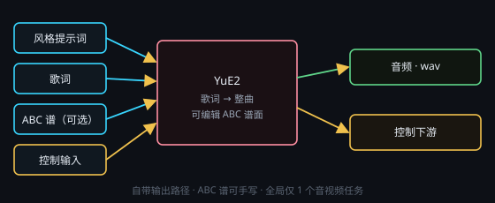

# YuE2 音乐生成（歌词 → 整曲）

画布右键 → **处理节点 › 音频生成 › YuE2**。本地 YuE2 后端（插件「YuE2 本地音乐」，对照开源项目 [YuE](https://github.com/multimodal-art-projection/YuE) 移植）。**每次运行只生成一个音频文件**（`.wav`），写入节点自带的 `outputPath`，不需要再挂保存节点。

YuE2 是「歌词 → 整曲」路线：给它一段**风格提示词**和一份**歌词**，它直接唱出完整歌曲，还能顺带产出 **ABC 谱面**；谱面可以手工写好再喂给它（端子 2 / 节点内填写）。

## 端子
- **输入**：端口 0 = 风格提示词 · 端口 1 = 歌词 · 端口 2 = ABC 谱（可选）· 端口 3 = 控制输入
- **输出**：端口 0 = 音频（下游可试听 / 保存）· 端口 1 = 控制输出

端子 0 / 1 / 2 未接线时，直接读节点上填写的风格提示词 / 歌词 / ABC 谱。

## 参数
点节点头部 **⚙ 设置** 打开设置窗口来改；改完即时生效，节点卡片上只显示一行当前摘要。

- **输出路径**：`.wav` 保存位置（相对工作目录 / 超级节点子文件夹）
- **思维链档位**：`full`（完整思维链，质量最好）· `melody`（旋律引导，更快）· `off`（关思维链，只按提示词）
- **抽卡次数**：多次尝试（1–10），每次只出一条，输出命名 `#1`、`#2` …
- **种子**：固定种子可复现；**摇数**开启时每次抽卡种子 +1
- **auto CPU offload（24G 推荐）**：把部分权重换出显存，24G 显卡建议保持开启

## 注意
- 全局同一时刻只允许 **1 个音视频任务**（音乐 / 语音 / 视频互斥），其它任务会排队等待。
- 每个后端实例全局只有一个，多个 YuE2 节点共享同一后端；本节点与 Minimax Music 3 也共享同一条串行链。
- 后端要在本机装环境，**建议 NVIDIA 24G 显存级别**；没装时节点会显示「插件未安装」警示条，安装入口在 **插件 › YuE2 本地音乐**。
- 歌词与风格提示词的写法可参考**内置技能** `minimax-music-lyrics` / `minimax-music-prompt` 的口径（随应用发版，不用从创意工坊下载；结构与语气对 YuE2 同样适用，风格提示词固定产出**一段六句英文散文**：曲风+情绪 → 速度与律动 → 乐器 → 人声 → 段落对比 → 制作混音）。
- **后端报错会弹窗**：装坏 / 跑挂时主窗口会弹一份**错误报告**（错误码、错误正文、console 日志尾部、出问题的节点），并问你要不要「**🤖 自动修复**」——新建一条你看得见的会话，按安装技能 `yue2-local-install` 的【自我修复】模式在**本插件的 INSTALL_DIR** 里修，修好后**自动重启 YuE2 后端**并刷新本节点状态。主动取消、正在安装中、磁盘不够、没 N 卡、驱动太旧、安装目录不合法这几类**只报告不自动修**（详见手册「插件报错弹窗与自动修复」）。
